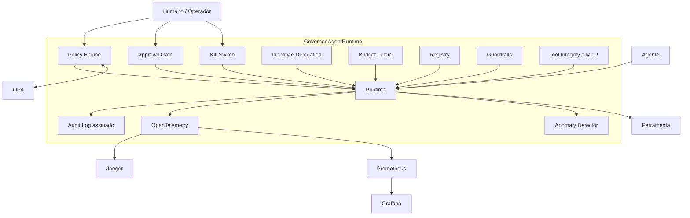

# Governança Agêntica

> Implementação de referência para governança de agentes de IA autônomos.
> O projeto é executável, offline por padrão e neutro em relação a provedores de LLM.

## Por que este repositório existe

Agentes de IA podem ler dados sensíveis, chamar APIs, enviar comunicações, modificar
infraestrutura e delegar tarefas para outros agentes. Sem uma camada de governança, cada
agente vira uma superfície de ataque separada, com pouca visibilidade e revogação difícil.

Este repositório mostra uma forma prática de controlar esse risco. Ele reúne runtime,
políticas, identidade, auditoria, aprovação humana, observabilidade, evals adversariais e
controles de supply chain em uma base pequena o suficiente para estudar e adaptar.

## Estado atual

- 13 exemplos executáveis.
- 232 testes unitários coletados pelo pytest.
- 23 cenários adversariais no eval gate.
- 14 documentos técnicos em `docs/`.
- 9 ADRs, incluindo neutralidade de provedor e ferramenta de agente.
- Nenhuma chave de API é necessária para rodar o projeto.

A evolução é **incremental e diária**: o backlog priorizado vive em
[`ROADMAP.md`](ROADMAP.md), cada mudança é registrada em [`CHANGELOG.md`](CHANGELOG.md), e o
ritual está descrito no [Fluxo de Melhoria Diária](CONTRIBUTING.md#fluxo-de-melhoria-diária).

O LLM usado nos exemplos é simulado pelo `MockLlmProvider`. A camada `governance.llm`
materializa o contrato do [`ADR-009`](docs/adr/ADR-009-neutralidade-de-provedor-llm.md):
o domínio depende das abstrações `LlmProvider`/`LlmRequest`/`LlmResponse`, e integrações
reais (OpenAI, Anthropic, Azure, Ollama, modelos locais) entram por adapters de import
preguiçoso — instaláveis como extras opcionais (ex.: `pip install '.[anthropic]'`) — sem
contaminar o domínio. `GovernedLlmProvider` aplica orçamento, guardrails, auditoria e
telemetria à própria inferência.

## Quickstart

```bash
git clone https://github.com/glaucojbs/agenticgovernance
cd agenticgovernance

make setup
make demo
make test
make eval
```

Com Docker, também é possível subir a stack de observabilidade:

```bash
make stack
make demo-observability
```

Serviços locais:

| Serviço | URL | Uso |
|---------|-----|-----|
| Jaeger | http://localhost:16686 | Traces por ação |
| Grafana | http://localhost:3000 | Dashboard de governança |
| Prometheus | http://localhost:9090 | Métricas de runtime |
| OPA | http://localhost:8181 | Política Rego via REST |

## Arquitetura em uma frase

Toda ação de agente passa pelo `GovernedAgentRuntime`. O runtime valida identidade,
registry, política, orçamento, aprovação humana, guardrails, integridade de ferramenta e
kill switch antes de executar qualquer ferramenta.



## Componentes principais

| Componente | Responsabilidade |
|------------|------------------|
| `identity/` | Identidade, escopos, credenciais e cadeia de delegação |
| `policy/` | Motor YAML, OPA client, dry-run e condições temporais |
| `audit/` | Log JSONL append-only com hash chain |
| `signing/` | Assinatura Ed25519 das entradas de auditoria |
| `approval/` | Aprovação humana, M-de-N e kill switch |
| `budget/` | Limites de custo, tokens, chamadas e rate limit |
| `registry/` | Catálogo de agentes e ferramentas |
| `runtime/` | Ponto único de execução governada |
| `telemetry/` | OpenTelemetry e atributos `gen_ai.*` |
| `llm/` | Camada provider-neutral: `LlmProvider`, adapters e inferência governada |
| `anomaly/` | Detecção rule-based de comportamento suspeito |
| `masking/` | Redação de PII antes de persistir logs |
| `circuit_breaker/` | Contenção de ferramentas instáveis |
| `guardrails/` | Prompt injection, DLP de egress e secret leak |
| `supply_chain/` | Fingerprint de ferramentas, allowlist MCP e AI-BOM |
| `memory/` | Memória com rótulos de confiança e quarentena |
| `a2a/` | Comunicação entre agentes com assinatura e anti-replay |
| `vault/` | Store simulado de segredos com TTL, versão e rotação |
| `forensics/` | Replay de incidentes a partir do audit log |
| `compliance/` | Evidências e model card |
| `tenancy/` | Isolamento multi-tenant |
| `cli/` | Operação por linha de comando |

## Estrutura do repositório

```text
src/governance/      Código dos controles de governança
policies/            Políticas YAML e exemplos Rego
examples/            13 demonstrações executáveis
evals/               23 cenários adversariais usados no CI
docs/                Documentação técnica e ADRs
threat-model/        Modelo de ameaça STRIDE e OWASP
runbooks/            Procedimentos operacionais
tests/               232 testes unitários
docker/              Jaeger, Prometheus, Grafana e OPA
```

## Princípios materializados

1. Privilégio mínimo por padrão.
2. Política como código.
3. Auditoria verificável.
4. Supervisão humana proporcional ao risco.
5. Contenção do raio de impacto.
6. Identidade verificável e delegação explícita.
7. Ciclo de vida governado.
8. Neutralidade de provedor e ferramenta de agente.

## Maturidade implementada

| Camada | Implementado |
|--------|--------------|
| Base | Policy engine, identity, audit log, signing, budget, approval, registry e runtime |
| Observabilidade | OpenTelemetry, métricas, OPA, Prometheus, Grafana e Jaeger |
| Produção simulada | PII masking, circuit breaker, dry-run, forensics, vault simulado, tenancy e CLI |
| Segurança agêntica | Guardrails, tool integrity, MCP allowlist, AI-BOM, memória governada e A2A assinado |
| Neutralidade de LLM | `LlmProvider`/`GovernedLlmProvider`, `MockLlmProvider` e adapters lazy (Anthropic, OpenAI, Azure, Ollama) |
| Compliance | Mapeamento NIST, ISO 42001, EU AI Act, OWASP LLM, OWASP Agentic e NIST GenAI |

## Documentação

Comece por [`docs/00-visao-geral.md`](docs/00-visao-geral.md). Os ADRs ficam em
[`docs/adr/`](docs/adr/), incluindo a decisão sobre neutralidade de provedor em
[`ADR-009`](docs/adr/ADR-009-neutralidade-de-provedor-llm.md).

## Próximos passos para produção real

| Tema | Recomendação |
|------|--------------|
| Identidade | SPIFFE/SVID por workload |
| Signing | Vault/KMS ou HSM para chaves Ed25519 |
| Política | OPA Bundle Server com propagação versionada |
| Auditoria | Kafka para storage durável e consulta analítica |
| Isolamento | gVisor, Kata ou sandbox equivalente |
| Rede | mTLS com Istio, Linkerd ou service mesh equivalente |
| Aprovação | Integração com Slack, PagerDuty ou sistema interno |
| Anomalia | Baselines estatísticos e modelos especializados |
| Compliance | Automação de evidências para auditorias externas |

Esses temas estão decompostos em itens executáveis na **Trilha A — Hardening de Produção**
do [`ROADMAP.md`](ROADMAP.md), endereçados via seams de adapter para preservar a neutralidade.

Este repositório é educacional. O mapeamento de compliance é ilustrativo e não substitui
avaliação jurídica ou regulatória.
