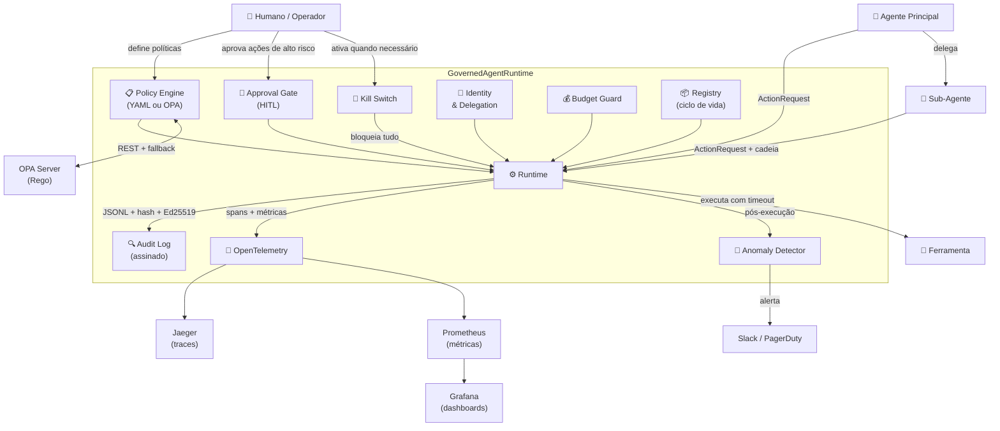

# Governança Agêntica — Repositório de Referência

> Implementação de referência executável para governança de agentes de IA autônomos.
> Da camada básica de controle até o nível big tech: privilégio mínimo, política como código,
> auditoria criptograficamente verificável, supervisão humana, observabilidade e detecção de anomalias.

---

## Por que este repositório existe

Agentes de IA autônomos podem executar ações de alto impacto — apagar dados, enviar e-mails,
modificar infraestrutura — sem que um humano esteja presente em cada decisão. Sem governança
adequada, isso cria riscos sérios de segurança, privacidade e conformidade.

Este repositório não é um produto. É um **exemplo didático, robusto e auditável** que um time
pode clonar, rodar em minutos e usar como base para sua própria governança de IA agêntica.

---

## Quickstart

```bash
git clone https://github.com/glaucojbs/agenticgovernance
cd agenticgovernance

make setup          # cria virtualenv + instala deps
make demo           # roda os 5 exemplos em sequência
make test           # testes unitários com cobertura
make eval           # eval gate (15 cenários adversariais)
```

Nenhuma chave de API é necessária. O "LLM" dos exemplos é um agente **simulado** (mock) plugável.

### Stack de observabilidade (opcional, requer Docker)

```bash
make stack          # sobe Jaeger + Prometheus + Grafana + OPA
make demo-observability  # roda exemplos enviando traces para Jaeger
```

Serviços disponíveis após `make stack`:

| Serviço | URL | Para que serve |
|---------|-----|---------------|
| Jaeger | http://localhost:16686 | Distributed traces de cada ação |
| Grafana | http://localhost:3000 (admin/admin) | Dashboard de governança pré-configurado |
| Prometheus | http://localhost:9090 | Métricas de policy/budget/approvals |
| OPA | http://localhost:8181 | Motor de política Rego em produção |

---

## Arquitetura



### Control Plane vs. Data Plane

| Camada | Componentes | Responsabilidade |
|--------|------------|-----------------|
| **Control Plane** | Policy Engine, Registry, Identity, Approval Gate | Define *o que pode acontecer* |
| **Data Plane** | Runtime, Budget Guard, Audit Log, Kill Switch, Telemetry, Anomaly | Controla *o que acontece* em tempo real |

---

## Os 7 Princípios Materializados

| # | Princípio | Onde está no código |
|---|-----------|---------------------|
| 1 | Privilégio mínimo por padrão | `policies/default-deny.yaml` + `policy/engine.py` |
| 2 | Política como código | `src/governance/policy/` + `policies/` + OPA client |
| 3 | Auditabilidade total | `src/governance/audit/` (JSONL + hash chain + Ed25519) |
| 4 | Supervisão humana proporcional ao risco | `src/governance/approval/` + `examples/04_*` |
| 5 | Contenção do raio de impacto | `src/governance/budget/` + timeout + sandbox |
| 6 | Identidade verificável e delegação | `src/governance/identity/` |
| 7 | Governança de ciclo de vida | `src/governance/registry/` + `evals/` |

---

## Estrutura

```
src/governance/
  identity/       — AgentIdentity, escopos, DelegationChain, credenciais
  policy/         — PolicyEngine YAML + OpaPolicyEngine + PolicyDryRun + condições temporais
  audit/          — AuditLogger append-only JSONL com hash chain SHA-256
  signing/        — AuditSigner Ed25519 + SignedAuditLogger
  approval/       — ApprovalGate HITL + NApprovalGate (M-de-N) + kill switch global
  budget/         — BudgetGuard (custo, tokens, calls, rate limit)
  registry/       — ToolRegistry + AgentRegistry (registered/approved/deprecated)
  runtime/        — GovernedAgentRuntime + GovernanceConfig (injeção limpa)
  telemetry/      — OpenTelemetry (spans + métricas, exporters console e OTLP)
  anomaly/        — AnomalyDetector (velocity, deny rate, consecutive denies, off-hours)
  masking/        — PIIMasker (e-mail, CPF, JWT, IP, cartão, padrões custom)
  circuit_breaker/— CircuitBreaker por ferramenta (CLOSED/OPEN/HALF_OPEN)
  signing/        — AuditSigner Ed25519 + SignedAuditLogger
  vault/          — SecretStore (TTL, versões, access policy, rotação, audit)
  forensics/      — IncidentReplayer (timeline, negações consecutivas, resumo)
  compliance/     — ComplianceReporter (evidências → NIST/ISO/EU AI Act/OWASP)
  tenancy/        — Tenant + TenantRegistry + TenantRuntime (isolamento multi-tenant)
  cli/            — CLI operacional (kill-switch, audit, policy, forensics, report)

policies/         — YAML de política (versionados, testáveis, default-deny)
docker/           — Prometheus, Grafana, OPA configs para make stack
examples/
  01_ungoverned_agent/       — anti-exemplo: agente sem nenhum controle
  02_governed_agent/         — mesmo agente sob governança completa + audit trail
  03_multi_agent_delegation/ — delegação rastreável + escalada de privilégio bloqueada
  04_high_risk_approval/     — HITL + kill switch de emergência
  05_production_stack/       — OTEL + Ed25519 + Anomaly + OPA
  06_forensics/              — reconstrução de timeline de incidente
  07_multi_tenant/           — três equipes isoladas + kill switch local e global
  08_compliance_report/      — PII masking + M-de-N approval + dry-run + evidências
evals/          — 15 cenários adversariais (eval gate do CI)
docs/           — 10 documentos pt-BR com diagramas Mermaid
threat-model/   — STRIDE + OWASP Top 10 LLM/Agentic
runbooks/       — kill switch, incident response, revogação de credenciais
tests/          — 124 testes unitários
```

Documentação detalhada: [`docs/00-visao-geral.md`](docs/00-visao-geral.md)

---

## Níveis de maturidade implementados

### Camada base (L1–L2) — funciona sem infraestrutura

- [x] Motor de política declarativo YAML (default-deny, conditions, ALLOW/DENY/REQUIRE_APPROVAL)
- [x] Modelo de identidade com escopos explícitos, tokens de curta duração e revogação
- [x] Cadeia de delegação rastreável — prevenção de escalada de privilégio
- [x] Audit log append-only JSONL com hash chain SHA-256 e `verify_chain()`
- [x] **Assinatura criptográfica Ed25519** em cada entrada do audit log
- [x] Budget guard (custo USD, tokens, nº de chamadas, rate limit por minuto)
- [x] Approval gate HITL com kill switch global (arquivo em disco)
- [x] Catálogo de agentes e ferramentas com ciclo de vida (registered → approved → deprecated)
- [x] GovernedAgentRuntime orquestrando os 8 controles em sequência
- [x] 5 exemplos executáveis
- [x] Eval gate com 15 cenários adversariais (exit code ≠ 0 se barreira ceder)
- [x] CI: lint + testes + eval gate + smoke test dos exemplos

### Camada observabilidade (L2–L3) — ativa com `make stack`

- [x] **OpenTelemetry** — span por ação com atributos de agente/ferramenta/decisão/risco
- [x] Métricas: latência P95/P99, policy decisions, approvals, budget, kill switch triggers
- [x] **Anomaly Detector** em tempo real — velocity, deny rate, consecutive denies, off-hours, new tool
- [x] **OPA client** com fallback automático para YAML (fail-closed sem infraestrutura)
- [x] Docker Compose: Jaeger, Prometheus, Grafana, OPA
- [x] Dashboard Grafana pré-configurado (8 painéis de governança)
- [x] Políticas Rego executáveis no OPA server

### Camada produção (L3–L4) — sem dependências externas

- [x] **PII Masking** — redação automática de e-mail, CPF, JWT, IP, cartão antes de gravar no log
- [x] **Circuit Breaker** por ferramenta — CLOSED/OPEN/HALF_OPEN com transições auditáveis
- [x] **GovernanceConfig** — injeção limpa de capacidades opcionais no runtime
- [x] **N-of-M Approval** — exige M aprovações de um conjunto de N para operações críticas
- [x] **Policy Dry-run** — compara decisões atual × proposta antes de aplicar mudança
- [x] **Condições temporais** — políticas que restringem por hora UTC e dia da semana
- [x] **IncidentReplayer** — reconstrói timeline forense a partir do audit log
- [x] **ComplianceReporter** — coleta evidências mapeadas a NIST AI RMF / ISO 42001 / EU AI Act
- [x] **SecretStore simulado** — padrão Vault/KMS com TTL, versões, access policy e rotação
- [x] **Multi-tenancy** — isolamento completo entre equipes (policy, budget, audit, kill switch)
- [x] **CLI operacional** — `governance kill-switch`, `audit verify/stats/replay`, `policy eval/dryrun`, `forensics`, `report compliance`
- [x] 8 exemplos executáveis (01 anti-exemplo → 08 compliance + PII)

### Compliance e documentação

- [x] Mapeamento: NIST AI RMF, ISO/IEC 42001, EU AI Act, OWASP LLM/Agentic Top 10
- [x] Threat model STRIDE + OWASP Top 10 for LLM/Agentic Applications
- [x] 3 Architecture Decision Records (ADR)
- [x] Runbooks operacionais (kill switch, incident response, revogação)
- [x] **Arquitetura de produção L1→L4** com SPIFFE, Kafka, gVisor, Vault/KMS, ML anomaly

---

## Próximos passos para L3/L4 (produção real)

| # | O que | Por que | Referência |
|---|-------|---------|------------|
| 1 | **SPIFFE/SVID** | Identidade criptográfica por workload sem tokens em memória | [docs/10](docs/10-arquitetura-producao.md) |
| 2 | **Vault/KMS para signing** | Chave Ed25519 nunca em disco — operações no HSM | [docs/10](docs/10-arquitetura-producao.md) |
| 3 | **OPA Bundle Server** | Políticas propagam via S3 sem redeploy | [docker/opa](docker/opa/) |
| 4 | **Kafka → Iceberg** | Audit log replicado, durável e queryável por SQL | [docs/10](docs/10-arquitetura-producao.md) |
| 5 | **gVisor / Kata** | Agente comprometido não escapa para o host | [docs/10](docs/10-arquitetura-producao.md) |
| 6 | **Istio/Linkerd (mTLS)** | Zero-trust networking entre serviços | [docs/10](docs/10-arquitetura-producao.md) |
| 7 | **PagerDuty + Slack bot** | Aprovação humana com SLA e escalação automática | [docs/06](docs/06-supervisao-humana.md) |
| 8 | **ML anomaly detection** | Baselines comportamentais + desvios estatísticos | [docs/10](docs/10-arquitetura-producao.md) |
| 9 | **Compliance automation** | Evidências para SOC2/ISO 42001 via Drata/Vanta | [docs/09](docs/09-mapeamento-compliance.md) |

---

*Este repositório é um exemplo educacional. O mapeamento de compliance é ilustrativo
e não constitui aconselhamento jurídico.*
