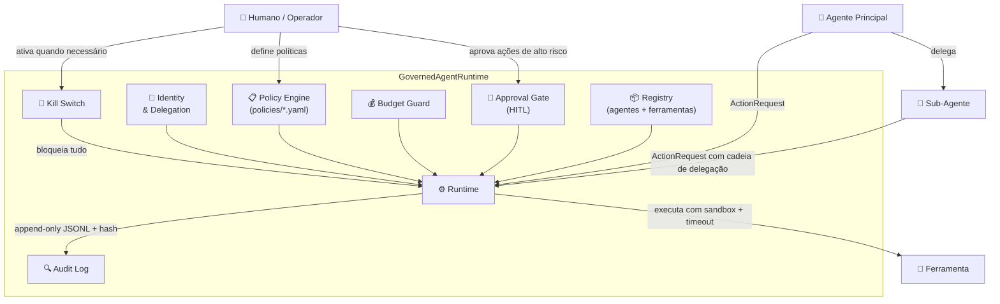

# Governança Agêntica — Repositório de Referência

> Implementação de referência executável para governança de agentes de IA autônomos.
> Demonstra, na prática, como aplicar privilégio mínimo, política como código, auditoria
> verificável, supervisão humana e contenção de impacto em sistemas multi-agente.

---

## Por que este repositório existe

Agentes de IA autônomos podem executar ações de alto impacto — apagar dados, enviar e-mails,
modificar infraestrutura — sem que um humano esteja presente em cada decisão. Sem governança
adequada, isso cria riscos sérios de segurança, privacidade e conformidade.

Este repositório não é um produto. É um **exemplo didático, robusto e auditável** que um time
pode clonar, rodar em minutos e usar como base para sua própria governança de IA agêntica.

---

## Quickstart

```bash
git clone <este-repo>
cd agenticgovernance

make setup          # cria virtualenv + instala deps
make demo           # roda os 4 exemplos em sequência
make test           # testes unitários com cobertura
make eval           # eval gate (barreiras adversariais)
```

Nenhuma chave de API é necessária. O "LLM" dos exemplos é um agente **simulado** (mock) plugável.

---

## Arquitetura



### Control Plane vs. Data Plane

| Camada | Componentes | Responsabilidade |
|--------|------------|-----------------|
| **Control Plane** | Policy Engine, Registry, Identity, Approval Gate | Define *o que pode acontecer* |
| **Data Plane** | Runtime, Budget Guard, Audit Log, Kill Switch | Controla *o que acontece* em tempo real |

---

## Os 7 Princípios Materializados

| # | Princípio | Onde está no código |
|---|-----------|---------------------|
| 1 | Privilégio mínimo por padrão | `policies/default-deny.yaml` + `policy/engine.py` |
| 2 | Política como código | `src/governance/policy/` + `policies/` |
| 3 | Auditabilidade total | `src/governance/audit/` (JSONL + hash chain) |
| 4 | Supervisão humana proporcional ao risco | `src/governance/approval/` + `examples/04_*` |
| 5 | Contenção do raio de impacto | `src/governance/budget/` + `runtime/sandbox.py` |
| 6 | Identidade verificável e delegação | `src/governance/identity/` |
| 7 | Governança de ciclo de vida | `src/governance/registry/` + `evals/` |

---

## Estrutura

```
src/governance/     — núcleo de governança (identity, policy, audit, approval, budget, registry, runtime)
policies/           — arquivos de política YAML (versionados, testáveis)
examples/           — 4 exemplos executáveis (01 anti-exemplo → 04 HITL)
evals/              — eval gate: cenários adversariais que o CI precisa passar
docs/               — documentação completa (pt-BR) com diagramas Mermaid
threat-model/       — STRIDE + OWASP Top 10 for LLM/Agentic
runbooks/           — kill switch, resposta a incidentes, revogação de credenciais
tests/              — pytest cobrindo o core de governança
```

Documentação detalhada: [`docs/00-visao-geral.md`](docs/00-visao-geral.md)

---

## O que foi implementado

- [x] Motor de política declarativo (YAML, default-deny, conditions, ALLOW/DENY/REQUIRE_APPROVAL)
- [x] Modelo de identidade com escopos, tokens de curta duração e revogação
- [x] Cadeia de delegação rastreável (humano → agente → sub-agente)
- [x] Audit log append-only com hash encadeado e verificação de integridade
- [x] Budget guard (custo, tokens, nº de chamadas, rate limit)
- [x] Approval gate HITL com kill switch global
- [x] Catálogo de agentes e ferramentas com status de ciclo de vida
- [x] GovernedAgentRuntime orquestrando todos os controles
- [x] 4 exemplos executáveis demonstrando os cenários principais
- [x] Eval gate com cenários adversariais
- [x] Mapeamento de compliance: NIST AI RMF, ISO/IEC 42001, EU AI Act, OWASP LLM/Agentic
- [x] Threat model STRIDE completo
- [x] Runbooks operacionais

## Próximos Passos para Produção

1. **OPA/Cedar real** — substituir o motor YAML por Open Policy Agent ou Cedar para
   expressividade e performance em grande escala.
2. **Identidade federada (SPIFFE/SVID)** — emitir identidades criptograficamente verificáveis
   para cada agente via SPIFFE Workload API.
3. **OpenTelemetry** — exportar spans e métricas do runtime para Jaeger/Grafana.
4. **Persistência imutável da trilha de auditoria** — gravar no S3/GCS com Object Lock ou
   em blockchain permissionada para compliance regulatório.
5. **Assinatura criptográfica dos registros de auditoria** — usar chave assimétrica (Ed25519)
   para assinar cada entrada além do hash encadeado.
6. **Painel de aprovação real** — substituir o aprovador simulado por um webhook (Slack,
   PagerDuty) ou UI dedicada.
7. **Eval contínuo em CI** — rodar os cenários adversariais a cada PR, com relatório de
   regressão de governança.

---

*Este repositório é um exemplo educacional. O mapeamento de compliance é ilustrativo
e não constitui aconselhamento jurídico.*
