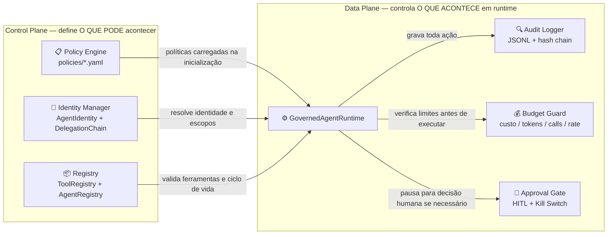
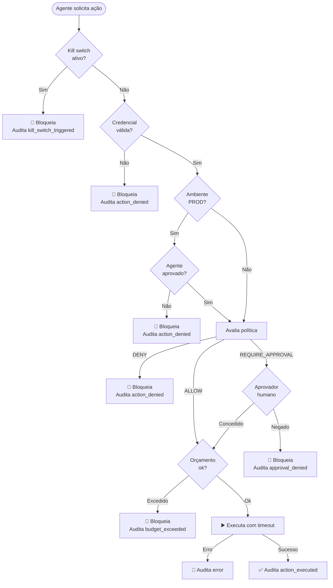

# 01 — Arquitetura

## Control Plane vs. Data Plane

A governança é dividida em duas camadas com responsabilidades distintas:



## Fluxo de execução de uma ação

Cada vez que um agente solicita a execução de uma ferramenta, o runtime percorre
este fluxo em ordem:



## Componentes

### GovernedAgentRuntime

O coração do sistema. É o **único ponto de entrada** para execução de ferramentas.
Nenhum agente deve jamais chamar uma ferramenta diretamente — toda execução passa
pelo runtime.

```
src/governance/runtime/governed.py
```

### Policy Engine

Avalia `ActionRequest` contra arquivos YAML versionados. Retorna `ALLOW`, `DENY`
ou `REQUIRE_APPROVAL` com o motivo e a regra que bateu.

Princípio fundamental: **default-deny**. Sem uma regra `ALLOW` explícita, nega.

```
src/governance/policy/engine.py
policies/*.yaml
```

### Identity & Delegation

Cada agente tem uma `AgentIdentity` com escopos explicitamente concedidos.
A `DelegationChain` rastreia toda transferência de autoridade e impede escalada
de privilégio: um agente não pode delegar o que não possui.

```
src/governance/identity/
```

### Audit Logger

Log append-only em JSONL com **encadeamento de hash SHA-256**. Cada entrada
inclui o hash da anterior. `verify_chain()` detecta qualquer adulteração.

```
src/governance/audit/logger.py
```

### Budget Guard

Tetos configuráveis por agente: custo USD simulado, tokens, número de chamadas
e taxa por minuto. Ao estourar, bloqueia a próxima ação antes de executar.

```
src/governance/budget/guard.py
```

### Approval Gate + Kill Switch

Para ações `REQUIRE_APPROVAL`, o runtime pausa e aguarda decisão humana.
O **kill switch** é uma flag global (arquivo em disco) que, se ativo, bloqueia
toda e qualquer execução de agente até ser manualmente desativado.

```
src/governance/approval/gate.py
```

### Registry

Catálogo de ferramentas (metadados de segurança, escopo exigido, destrutividade)
e de agentes (ciclo de vida: `registered` → `approved` → `deprecated`).
Somente agentes `approved` podem operar em `prod`.

```
src/governance/registry/catalog.py
```

## Princípio de design: fail-safe defaults

Todos os componentes foram projetados para **falhar de forma segura**:

| Situação | Comportamento |
|----------|--------------|
| Política não encontrada | `DENY` (default-deny) |
| Aprovador não configurado | `DENY` (fallback seguro) |
| Kill switch ativo | Bloqueia tudo |
| Agente não no registry | Bloqueado em `prod` |
| Credencial ausente/expirada/revogada | `DENY` |
| Ferramenta sem implementação | Erro auditado, não executa |
| Timeout de execução | Erro auditado |
