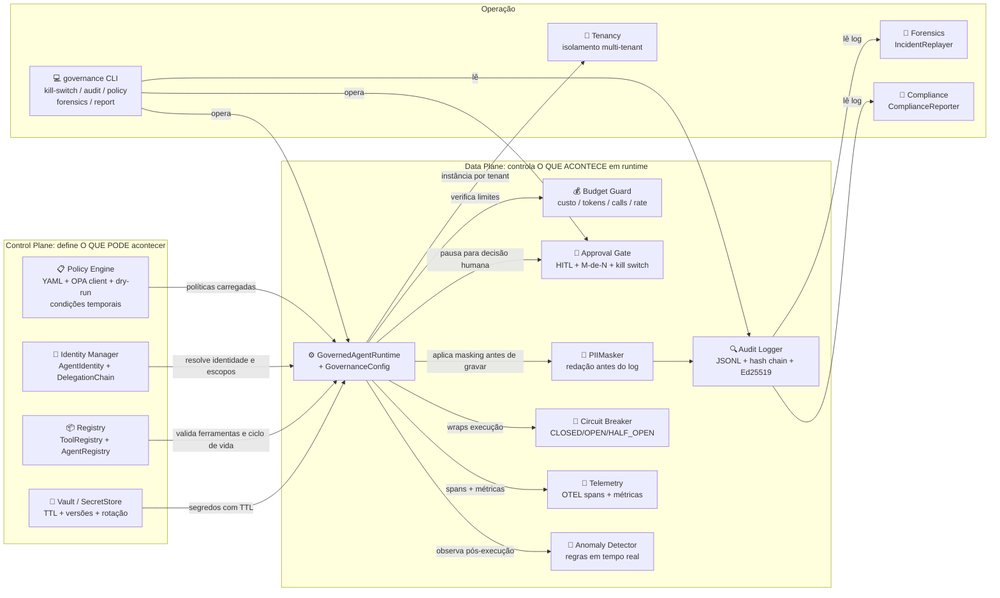
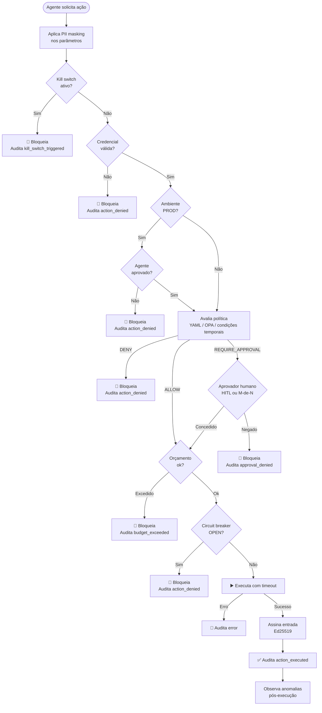

# 01: Arquitetura

## Control Plane vs. Data Plane

A governança é dividida em duas camadas com responsabilidades distintas:



## Fluxo de execução de uma ação

Cada vez que um agente solicita a execução de uma ferramenta, o runtime percorre
este fluxo em ordem:



## Componentes

### GovernedAgentRuntime + GovernanceConfig

O coração do sistema. É o **único ponto de entrada** para execução de ferramentas.
`GovernanceConfig` agrega as capacidades opcionais (telemetry, anomaly, masker, circuit breakers)
sem quebrar a API dos testes e exemplos existentes.

```
src/governance/runtime/governed.py
src/governance/runtime/config.py
```

### Policy Engine (YAML + OPA + dry-run + condições temporais)

Avalia `ActionRequest` contra arquivos YAML versionados. Retorna `ALLOW`, `DENY`
ou `REQUIRE_APPROVAL` com o motivo e a regra que bateu.

- **default-deny**: sem regra explícita, nega
- **OPA client**: delega para Open Policy Agent com fallback automático para YAML
- **dry-run**: compara decisões atual × proposta antes de aplicar mudança
- **condições temporais**: `allowed_utc_hours`, `allowed_weekdays` por regra

```
src/governance/policy/engine.py
src/governance/policy/opa_client.py
src/governance/policy/dryrun.py
policies/*.yaml
```

### Identity & Delegation

Cada agente tem uma `AgentIdentity` com escopos explicitamente concedidos.
A `DelegationChain` rastreia toda transferência de autoridade e impede escalada
de privilégio: um agente não pode delegar o que não possui.

```
src/governance/identity/
```

### Audit Logger + Signing

Log append-only em JSONL com **hash chain SHA-256** e **assinatura Ed25519** por entrada.
Sem a chave privada, é impossível forjar entradas retroativamente.
`verify_chain()` detecta adulteração; `verify_signatures()` detecta forjamento.

```
src/governance/audit/logger.py
src/governance/signing/signer.py
```

### Budget Guard

Tetos configuráveis por agente: custo USD simulado, tokens, número de chamadas
e taxa por minuto. Ao estourar, bloqueia a próxima ação antes de executar.

```
src/governance/budget/guard.py
```

### Approval Gate + NApprovalGate + Kill Switch

Para ações `REQUIRE_APPROVAL`, o runtime pausa e aguarda decisão humana.
`NApprovalGate` exige M aprovações de um conjunto de N aprovadores.
O **kill switch** (local por tenant ou global) bloqueia toda execução imediatamente.

```
src/governance/approval/gate.py
src/governance/approval/multi.py
```

### Registry

Catálogo de ferramentas (metadados de segurança, escopo exigido, destrutividade)
e de agentes (ciclo de vida: `registered` → `approved` → `deprecated`).
Somente agentes `approved` podem operar em `prod`.

```
src/governance/registry/catalog.py
```

### PIIMasker

Redação automática de dados pessoais (e-mail, CPF, CNPJ, JWT, IP, cartão) nos
parâmetros de ações antes de gravá-los no audit log. Padrões customizáveis via regex.

```
src/governance/masking/masker.py
```

### Circuit Breaker

Resiliência por ferramenta: após N falhas consecutivas, o circuito abre e o runtime
retorna erro imediatamente (fail-fast), protegendo o sistema de cascatas de falha.
Transições auditadas; reset manual pelo operador.

```
src/governance/circuit_breaker/breaker.py
```

### Telemetry (OpenTelemetry)

Emite spans para cada `execute()` com atributos de governança (agent_id, tool_name,
policy_decision, risk_level). Métricas: latência P95/P99, contadores de decisions/
approvals/budget/kill-switch. Exporters console (dev) e OTLP (Jaeger/Tempo/Grafana).

```
src/governance/telemetry/otel.py
```

### Anomaly Detector

Detecta padrões suspeitos em tempo real: alta velocidade, taxa de negação acima do limite,
negações consecutivas (possível brute-force), atividade fora do horário comercial, primeira
vez que um agente usa uma ferramenta. Alertas configuráveis por callbacks.

```
src/governance/anomaly/detector.py
```

### SecretStore (Vault simulado)

Padrão Vault/KMS sem dependência externa: segredos com TTL, versionamento (últimas N versões),
access policy por path, rotação com hooks de notificação e audit trail próprio.

```
src/governance/vault/store.py
```

### Forensics (IncidentReplayer)

Reconstrução de timeline a partir do audit log: filtragem por agente/período/tipo,
detecção de janelas de negações consecutivas, resumo de impacto. Verifica integridade
da chain antes de produzir o relatório.

```
src/governance/forensics/replayer.py
```

### ComplianceReporter

Varre o audit log e mapeia automaticamente cada tipo de evento para controles específicos
do NIST AI RMF, ISO/IEC 42001, EU AI Act e OWASP LLM. Exporta JSON para auditores externos.

```
src/governance/compliance/reporter.py
```

### Multi-tenancy

Isolamento completo entre equipes: cada tenant tem seu próprio PolicyEngine, BudgetGuard,
AgentRegistry, AuditLogger e kill switch. `TenantRuntime` garante que agentes de um tenant
não podem executar ações no contexto de outro. Kill switch global afeta todos.

```
src/governance/tenancy/tenant.py
```

### CLI operacional

Interface de linha de comando para operações sem necessidade de escrever código:

```bash
governance kill-switch status/enable/disable
governance audit verify/stats/replay <log_path>
governance policy eval --tool-name --environment --scopes
governance policy dryrun <current_dir> <proposed_dir>
governance forensics <log_path> [--agents]
governance report compliance <log_path> [--output]
```

```
src/governance/cli/main.py
```

## Princípio de design: fail-safe defaults

Todos os componentes foram projetados para **falhar de forma segura**:

| Situação | Comportamento |
|----------|--------------|
| Política não encontrada | `DENY` (default-deny) |
| Aprovador não configurado | `DENY` (fallback seguro) |
| OPA offline | Fallback para YAML; sem OPA e sem fallback → `DENY` |
| Kill switch ativo | Bloqueia tudo (local ou global) |
| Agente não no registry | Bloqueado em `prod` |
| Credencial ausente/expirada/revogada | `DENY` |
| Ferramenta sem implementação | Erro auditado, não executa |
| Timeout de execução | Erro auditado |
| Circuit breaker OPEN | Erro auditado, não executa |
| Tenant não encontrado | `DENY` com mensagem explicativa |
