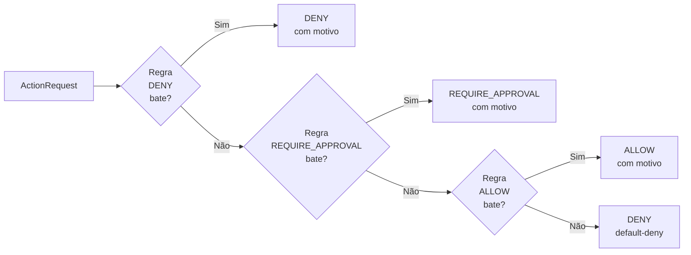

# 02 — Modelo de Governança

## Os 7 princípios

### 1. Privilégio mínimo por padrão
Todo agente nasce sem permissões. Toda capacidade é concedida explicitamente,
com escopo definido e por tempo limitado. A política `default-deny.yaml` garante
que ausência de regra = negação.

### 2. Política como código
As regras de governança são arquivos YAML versionados em `policies/`. Elas são
testáveis, revisáveis via diff e auditáveis via histórico Git. Nenhuma regra
de negócio está embutida no código do agente.

### 3. Auditabilidade total
Toda decisão e toda ação são registradas em JSONL com hash encadeado.
A trilha é à prova de adulteração: qualquer modificação posterior
invalida a verificação criptográfica. `verify_chain()` detecta corrupção.

### 4. Supervisão humana proporcional ao risco
Ações são classificadas por nível de risco (`low`, `medium`, `high`, `critical`).
Ações `high`/`critical` exigem aprovação humana antes de executar.
O kill switch global permite parar tudo instantaneamente.

### 5. Contenção do raio de impacto
Cada agente tem um orçamento máximo (custo, tokens, chamadas, taxa).
Ferramentas destrutivas são marcadas como tal e têm regras de negação
explícitas. Execuções têm timeout. Ambientes são segregados.

### 6. Identidade verificável e cadeia de delegação
Cada agente possui identidade própria com credenciais de curta duração.
A delegação humano → agente → sub-agente é rastreável e impede escalada
de privilégio: ninguém pode delegar o que não possui.

### 7. Governança de ciclo de vida
Agentes passam por um portão de avaliação antes de chegar a produção.
O catálogo mantém o histórico de versões e status. Agentes `deprecated`
não podem ser instanciados.

---

## Papéis e responsabilidades (RACI)

| Atividade | Humano Responsável | Agente | Times Técnicos | Auditoria |
|-----------|-------------------|--------|---------------|-----------|
| Definir políticas | **A** (Accountable) | — | **R** (Responsible) | — |
| Conceder escopos | **A** | — | **R** | **I** (Informed) |
| Registrar agente | — | — | **R** | **I** |
| Aprovar agente para prod | **A** | — | **R** | **I** |
| Aprovar ação de alto risco | **R/A** | — | — | **I** |
| Monitorar trilha de auditoria | **A** | — | **R** | **R** |
| Ativar kill switch | **R/A** | — | **C** (Consulted) | **I** |
| Revogar credencial | **A** | — | **R** | **I** |

---

## Fluxo de decisão de política

**Ordem de precedência:** `DENY` > `REQUIRE_APPROVAL` > `ALLOW` > default-deny

---

## Classificação de ambientes

| Ambiente | Restrições adicionais |
|----------|----------------------|
| `dev` | Sem restrições de ciclo de vida; approvals opcionais |
| `staging` | Algumas ações exigem aprovação (ex.: send_email) |
| `prod` | Apenas agentes `approved`; aprovações obrigatórias para risco alto |

---

## Modelo de ameaça resumido

| Ameaça | Controle |
|--------|---------|
| Agente executa ação não autorizada | default-deny + escopos explícitos |
| Agente ultrapassa limites de recurso | BudgetGuard |
| Sub-agente escala privilégios | DelegationChain.add_link |
| Agente não aprovado em prod | AgentRegistry.can_run_in_prod |
| Trilha de auditoria adulterada | Hash chain SHA-256 |
| Agente comprometido continua operando | Kill switch + revogação de credencial |
| Ação destrutiva acidental ou maliciosa | Policy deny explícito + approval |

O threat model completo está em [`threat-model/threat-model.md`](../threat-model/threat-model.md).
