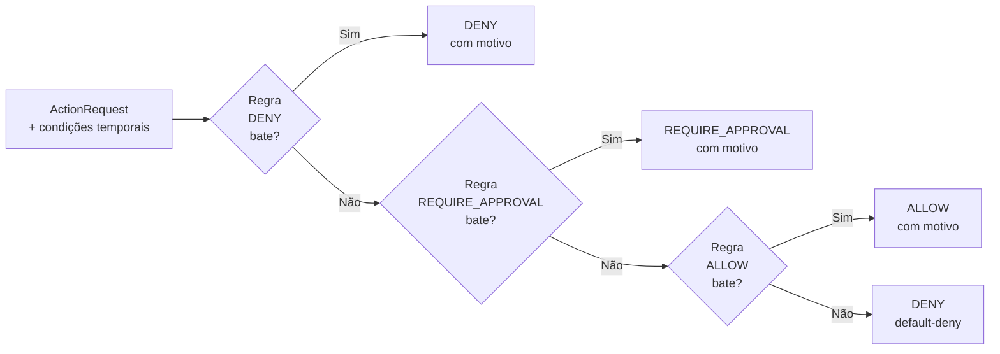

# 02 — Modelo de Governança

## Os 7 princípios

### 1. Privilégio mínimo por padrão
Todo agente nasce sem permissões. Toda capacidade é concedida explicitamente,
com escopo definido e por tempo limitado. A política `default-deny.yaml` garante
que ausência de regra = negação.

### 2. Política como código
As regras de governança são arquivos YAML versionados em `policies/`. Elas são
testáveis, revisáveis via diff e auditáveis via histórico Git. Nenhuma regra
de negócio está embutida no código do agente. O `PolicyDryRun` permite simular
mudanças antes de aplicar — toda modificação de política passa por PR review.

### 3. Auditabilidade total
Toda decisão e toda ação são registradas em JSONL com hash encadeado **e assinatura
Ed25519**. A trilha é à prova de adulteração: hash chain detecta modificações;
assinatura criptográfica impede forjamento mesmo com acesso ao disco.
`verify_chain()` e `verify_signatures()` detectam corrupção e forjamento respectivamente.
O `PIIMasker` garante que dados pessoais nunca entram no log em texto claro.

### 4. Supervisão humana proporcional ao risco
Ações são classificadas por nível de risco (`low`, `medium`, `high`, `critical`).
Ações `high`/`critical` exigem aprovação humana antes de executar. O `NApprovalGate`
permite exigir M aprovações de N aprovadores disponíveis. O kill switch global permite
parar tudo instantaneamente — local por tenant ou global na plataforma.

### 5. Contenção do raio de impacto
Cada agente tem um orçamento máximo (custo, tokens, chamadas, taxa).
Ferramentas destrutivas são marcadas como tal e têm regras de negação explícitas.
Execuções têm timeout. Ambientes são segregados. O `CircuitBreaker` por ferramenta
impede que falhas em uma tool cascateiem para o resto do sistema.
A multi-tenancy isola completamente o impacto entre equipes.

### 6. Identidade verificável e cadeia de delegação
Cada agente possui identidade própria com credenciais de curta duração.
A delegação humano → agente → sub-agente é rastreável e impede escalada
de privilégio: ninguém pode delegar o que não possui. O `SecretStore` gerencia
segredos com TTL, versionamento e access policy por caminho.

### 7. Governança de ciclo de vida
Agentes passam por um portão de avaliação antes de chegar a produção.
O catálogo mantém o histórico de versões e status. Agentes `deprecated`
não podem ser instanciados. O `ComplianceReporter` gera automaticamente
evidências para auditores externos.

---

## Papéis e responsabilidades (RACI)

| Atividade | Humano Responsável | Agente | Times Técnicos | Auditoria |
|-----------|-------------------|--------|---------------|-----------|
| Definir políticas | **A** | — | **R** | — |
| Revisar mudança de política (dry-run) | **A** | — | **R** | **I** |
| Conceder escopos | **A** | — | **R** | **I** |
| Registrar agente | — | — | **R** | **I** |
| Aprovar agente para prod | **A** | — | **R** | **I** |
| Aprovar ação de alto risco (HITL) | **R/A** | — | — | **I** |
| Aprovar ação crítica (M-de-N) | **R/A** (múltiplos) | — | — | **I** |
| Monitorar trilha de auditoria | **A** | — | **R** | **R** |
| Investigar incidente (forensics) | **A** | — | **R** | **R** |
| Ativar kill switch local | **R/A** | — | **C** | **I** |
| Ativar kill switch global | **R/A** (plataforma) | — | **C** | **I** |
| Revogar credencial | **A** | — | **R** | **I** |
| Gerenciar tenants | **A** (platform team) | — | **R** | **I** |
| Gerar relatório de compliance | — | — | **R** | **A** |

---

## Fluxo de decisão de política

**Ordem de precedência:** `DENY` > `REQUIRE_APPROVAL` > `ALLOW` > default-deny

**Condições temporais** (`allowed_utc_hours`, `allowed_weekdays`) são verificadas
durante `_rule_matches()` — uma regra que não passa a condição temporal é como se
não existisse para aquele request.

---

## Classificação de ambientes

| Ambiente | Restrições adicionais |
|----------|----------------------|
| `dev` | Sem restrições de ciclo de vida; approvals opcionais |
| `staging` | Algumas ações exigem aprovação (ex.: send_email) |
| `prod` | Apenas agentes `approved`; aprovações obrigatórias para risco alto |

---

## Modelo de ameaça resumido

| Ameaça | Controle principal | Controle secundário |
|--------|-------------------|-------------------|
| Agente executa ação não autorizada | default-deny + escopos explícitos | OPA client |
| Agente ultrapassa limites de recurso | BudgetGuard | CircuitBreaker |
| Sub-agente escala privilégios | DelegationChain.add_link | TenantRuntime.execute |
| Agente não aprovado em prod | AgentRegistry.can_run_in_prod | — |
| Trilha de auditoria adulterada | Hash chain SHA-256 | Assinatura Ed25519 |
| Dados pessoais expostos no log | PIIMasker (aplica antes do log) | — |
| Agente comprometido continua operando | Kill switch + revogação | NApprovalGate |
| Ação destrutiva acidental ou maliciosa | Policy deny explícito | M-de-N approval |
| Ferramenta com falhas cascateia | CircuitBreaker | Timeout |
| Agente de equipe A acessa recursos de B | TenantRuntime (isolamento) | Registry por tenant |
| Comportamento anômalo não detectado | AnomalyDetector (tempo real) | IncidentReplayer |
| Segredo exposto em variável de ambiente | SecretStore com TTL e access policy | — |

O threat model completo está em [`threat-model/threat-model.md`](../threat-model/threat-model.md).
