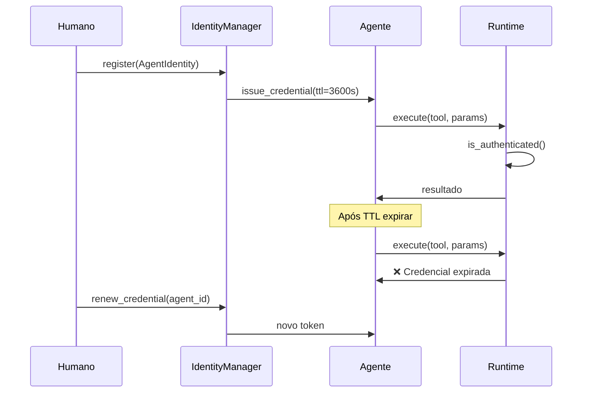
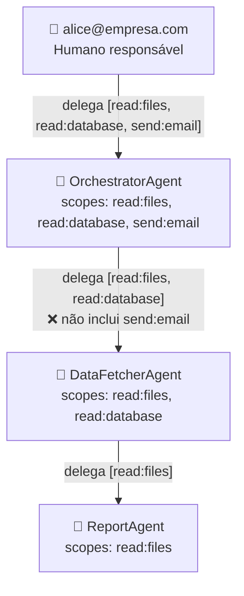

# 03 — Identidade e Acesso

## Modelo de identidade

Cada agente possui uma `AgentIdentity` com os seguintes atributos:

```python
AgentIdentity(
    id        = "data-analyst-v1",      # identificador único
    name      = "DataAnalystAgent",      # nome legível
    owner     = "alice@empresa.com",     # humano responsável
    environment = AgentEnvironment.DEV,  # dev | staging | prod
    scopes    = [READ_FILES, READ_DATABASE],  # escopos concedidos explicitamente
    parent_id = None,                    # None = agente raiz; ID = sub-agente
    version   = "1.0.0",
)
```

**Princípio:** um agente nasce com `scopes=[]`. Toda capacidade é adicionada explicitamente
por um humano com autoridade para isso. Não existe herança automática de escopos.

## Escopos disponíveis

| Escopo | O que permite |
|--------|--------------|
| `read:files` | Leitura de arquivos |
| `write:files` | Escrita em arquivos |
| `delete:files` | Exclusão de arquivos |
| `read:database` | Consultas de leitura |
| `write:database` | Inserção/atualização |
| `send:email` | Envio de e-mails |
| `send:notification` | Envio de notificações |
| `call:external_api` | Chamadas a APIs externas |
| `call:internal_api` | Chamadas a APIs internas |
| `spawn:subagent` | Criação de sub-agentes |
| `manage:agents` | Gerenciamento do ciclo de vida |
| `execute:code` | Execução de código arbitrário |
| `read:secrets` | Acesso a segredos/credenciais |

## Credenciais de curta duração



- Cada token é gerado com `secrets.token_hex(32)` — 256 bits de entropia
- O TTL padrão é 3600 segundos (1 hora); configurável por agente
- Credenciais podem ser **revogadas manualmente** a qualquer momento

## Cadeia de delegação



### Regra anti-escalada

`DelegationChain.add_link()` verifica que o delegante possui **todos** os escopos
que está tentando delegar. Se não possuir, levanta `PermissionError`:

```python
# ✓ Permitido — orchestrator tem read:files
chain.add_link(orchestrator, data_fetcher, [AgentScope.READ_FILES])

# ✗ Bloqueado — data_fetcher NÃO tem send:email
chain.add_link(data_fetcher, report_agent, [AgentScope.SEND_EMAIL])
# → PermissionError: Agente 'DataFetcherAgent' tentou delegar escopos que não possui: send:email
```

## Revogação

```python
# Revogação da credencial (agente perde autenticação imediatamente)
identity_manager.revoke(agent_id, reason="credencial comprometida")

# Revogação de um escopo específico (agente perde capacidade)
identity_manager.revoke_scope(agent_id, AgentScope.DELETE_FILES)
```

Após revogação, o runtime nega toda execução do agente afetado.
Veja o runbook: [`runbooks/revogar-credenciais-de-agente.md`](../runbooks/revogar-credenciais-de-agente.md)
