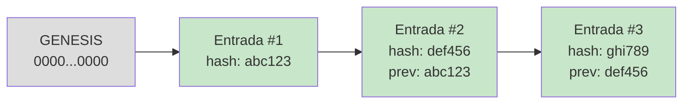
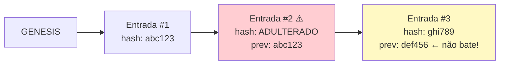

# 05 — Observabilidade e Auditoria

## O problema com logs convencionais

Logs convencionais (ex.: syslog, CloudWatch) são mutáveis: um atacante com acesso
ao sistema de logging pode apagar ou modificar registros sem deixar rastro.
Em contextos de IA agêntica — onde um agente comprometido pode ter acesso amplo —
isso é inaceitável.

## Hash chain: auditoria à prova de adulteração

Cada entrada do log inclui o hash SHA-256 da entrada anterior, formando uma cadeia:

```
Entrada #1: previous_hash=0000...0000  entry_hash=SHA256(dados_1 + "0000...0000")
Entrada #2: previous_hash=entry_hash_1 entry_hash=SHA256(dados_2 + entry_hash_1)
Entrada #3: previous_hash=entry_hash_2 entry_hash=SHA256(dados_3 + entry_hash_2)
```

Se qualquer entrada for modificada, seu hash não bate mais com o `previous_hash`
da entrada seguinte. `verify_chain()` detecta isso imediatamente.



Se a entrada #2 for adulterada:



## Formato JSONL

Cada linha é um JSON autocontido (facilita streaming e processamento com `jq`):

```json
{
  "sequence": 1,
  "event_type": "policy_decision",
  "timestamp": "2025-06-01T10:30:00.123456+00:00",
  "agent_id": "data-analyst-v1",
  "agent_name": "DataAnalystAgent",
  "tool_name": "read_files",
  "environment": "dev",
  "details": {
    "decision": "ALLOW",
    "reason": "Leitura de arquivos permitida para agentes com escopo 'read:files'.",
    "matched_rule": "allow-read-files",
    "policy_file": "example-readonly-agent.yaml"
  },
  "previous_hash": "0000000000000000000000000000000000000000000000000000000000000000",
  "entry_hash": "a3f2c8e1..."
}
```

## Tipos de eventos registrados

| `event_type` | Quando é criado |
|-------------|----------------|
| `policy_decision` | Toda vez que o motor de política avalia uma ação |
| `action_executed` | Ação executada com sucesso |
| `action_denied` | Ação negada por política |
| `approval_requested` | Aprovação humana solicitada |
| `approval_granted` | Aprovação concedida |
| `approval_denied` | Aprovação negada |
| `budget_exceeded` | Orçamento estourado |
| `kill_switch_triggered` | Kill switch bloqueou a execução |
| `kill_switch_activated` | Kill switch foi ativado |
| `credential_issued` | Nova credencial emitida |
| `credential_revoked` | Credencial revogada |
| `agent_registered` | Agente registrado no catálogo |
| `delegation_created` | Novo elo de delegação criado |
| `error` | Erro durante execução |

## Verificação de integridade

```python
from governance.audit.logger import AuditLogger

logger = AuditLogger("audit_logs/producao/audit.jsonl")
result = logger.verify_chain()

if result.valid:
    print(f"Chain válida: {result.total_entries} entradas verificadas")
else:
    print(f"ADULTERAÇÃO DETECTADA na entrada #{result.first_broken_at}")
    print(f"Detalhe: {result.error}")
```

## Replay de eventos

```python
# Reconstrução de tudo o que um agente fez
events = logger.get_events_for_agent("data-analyst-v1")
for event in events:
    print(f"[{event.timestamp}] {event.event_type} → {event.tool_name}")
```

## Próximos passos para produção

- **Persistência imutável**: gravar em S3/GCS com Object Lock ou Azure Blob com
  immutability policy para compliance regulatório
- **Assinatura criptográfica**: além do hash chain, assinar cada entrada com
  chave Ed25519 mantida num HSM
- **OpenTelemetry**: exportar eventos como spans para Jaeger/Grafana/Datadog
- **SIEM integration**: formatar em CEF/LEEF para ingestão em Splunk ou Sentinel
