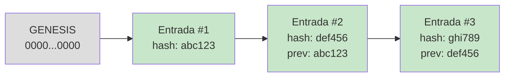

# 05: Observabilidade e Auditoria

## O problema com logs convencionais

Logs convencionais (ex.: syslog, CloudWatch) são mutáveis: um atacante com acesso
ao sistema de logging pode apagar ou modificar registros sem deixar rastro.
Em contextos de IA agêntica: onde um agente comprometido pode ter acesso amplo :
isso é inaceitável. Além disso, dados pessoais gravados em texto claro em logs
violam LGPD/GDPR.

## Hash chain: auditoria à prova de adulteração

Cada entrada do log inclui o hash SHA-256 da entrada anterior, formando uma cadeia:

```
Entrada #1: previous_hash=0000...0000  entry_hash=SHA256(dados_1 + "0000...0000")
Entrada #2: previous_hash=entry_hash_1 entry_hash=SHA256(dados_2 + entry_hash_1)
Entrada #3: previous_hash=entry_hash_2 entry_hash=SHA256(dados_3 + entry_hash_2)
```

Se qualquer entrada for modificada, seu hash não bate mais com o `previous_hash`
da entrada seguinte. `verify_chain()` detecta isso imediatamente.



## Assinatura Ed25519: proteção contra forjamento

O hash chain detecta adulteração mas não impede que um atacante com acesso ao disco
**recrie toda a cadeia** com novos hashes. A assinatura Ed25519 fecha essa lacuna:

```
Para cada entrada:
  payload = json.dumps(entry_data, sort_keys=True)
  signature = private_key.sign(payload)   # privada fica no HSM em produção
  log.write({...entry_data, "signature": base64(signature)})
```

Sem a chave privada, é matematicamente impossível forjar uma assinatura válida.
A chave pública pode ser distribuída a auditores externos para verificação independente.

```python
from governance.signing.signer import AuditSigner, SignedAuditLogger

# Gera par de chaves (em produção: carregar da KMS/Vault)
signer = AuditSigner.generate()
signer.save_keys("keys/audit_private.pem", "keys/audit_public.pem")

# Logger que assina cada entrada automaticamente
logger = SignedAuditLogger("audit_logs/prod.jsonl", signer)

# Verificação com chave pública (para auditores externos)
result = logger.verify_signatures(signer.public_key_pem())
print(f"Assinaturas válidas: {result['valid']} ({result['total']} entradas)")
```

## PII Masking: proteção antes do log

O `PIIMasker` é aplicado pelo runtime **antes** de gravar qualquer entrada :
dados pessoais nunca chegam ao log em texto claro:

```python
from governance.masking.masker import PIIMasker, MaskingPattern
from governance.runtime.config import GovernanceConfig

masker = PIIMasker.with_defaults()       # e-mail, CPF, CNPJ, JWT, IP, cartão
# Ou padrões seletivos:
masker = PIIMasker.with_patterns(MaskingPattern.EMAIL, MaskingPattern.CPF)
# Ou padrões customizados:
masker.add_rule(r"\b\d{4}-\d{4}\b", "[ACCOUNT]", "account_number")

# Injetar no runtime via GovernanceConfig
config = GovernanceConfig(pii_masker=masker)
```

**Antes do masking:**
```json
{"query": "SELECT * FROM users WHERE email='maria@empresa.com' AND cpf='123.456.789-00'"}
```

**Após o masking (o que fica no log):**
```json
{"query": "SELECT * FROM users WHERE email='[EMAIL]' AND cpf='[CPF]'"}
```

## Formato JSONL

Cada linha é um JSON autocontido (facilita streaming e processamento com `jq`):

```json
{
  "sequence": 1,
  "event_type": "policy_decision",
  "timestamp": "2025-06-01T10:30:00.123456+00:00",
  "agent_id": "data-analyst-v1",
  "agent_name": "DataAnalystAgent",
  "tool_name": "read_files",
  "environment": "dev",
  "details": {
    "decision": "ALLOW",
    "reason": "Leitura de arquivos permitida para agentes com escopo 'read:files'.",
    "matched_rule": "allow-read-files",
    "policy_file": "example-readonly-agent.yaml"
  },
  "previous_hash": "0000000000000000000000000000000000000000000000000000000000000000",
  "entry_hash": "a3f2c8e1...",
  "signature": "7fQ2Lm..."   ← presente quando usando SignedAuditLogger
}
```

## Tipos de eventos registrados

| `event_type` | Quando é criado |
|-------------|----------------|
| `policy_decision` | Toda vez que o motor de política avalia uma ação |
| `action_executed` | Ação executada com sucesso |
| `action_denied` | Ação negada por política ou controle de governança |
| `approval_requested` | Aprovação humana solicitada (HITL ou M-de-N) |
| `approval_granted` | Aprovação concedida |
| `approval_denied` | Aprovação negada |
| `budget_exceeded` | Orçamento estourado |
| `kill_switch_triggered` | Kill switch bloqueou a execução |
| `kill_switch_activated` | Kill switch foi ativado (local ou global) |
| `credential_issued` | Nova credencial emitida |
| `credential_revoked` | Credencial revogada |
| `agent_registered` | Agente registrado no catálogo |
| `delegation_created` | Novo elo de delegação criado |
| `error` | Erro durante execução |

## OpenTelemetry: observabilidade em tempo real

Cada `execute()` emite um span com atributos de governança:

```python
from governance.telemetry.otel import GovernanceTelemetry
from governance.runtime.config import GovernanceConfig

telemetry = GovernanceTelemetry.setup()   # console exporter por padrão
# Em produção:
# OTEL_EXPORTER=otlp OTEL_ENDPOINT=http://jaeger:4318 python app.py

config = GovernanceConfig(telemetry=telemetry)
```

Atributos dos spans:
- `governance.agent.id` / `governance.agent.name`
- `governance.tool.name`
- `governance.policy.decision` (ALLOW/DENY/REQUIRE_APPROVAL)
- `governance.risk.level`
- `governance.environment`

Métricas disponíveis:
- `governance.action.latency.ms` (histograma P95/P99)
- `governance.policy.decisions.total` (por decisão)
- `governance.actions.executed.total` / `governance.actions.denied.total`
- `governance.approvals.total` (por status)
- `governance.budget.exceeded.total`
- `governance.kill_switch.triggers.total`

## Verificação de integridade via CLI

```bash
# Verifica hash chain
governance audit verify audit_logs/prod/audit.jsonl

# Estatísticas do log
governance audit stats audit_logs/prod/audit.jsonl

# Replay com filtro por agente
governance audit replay audit_logs/prod/audit.jsonl --agent data-analyst-v1
```

## Análise forense com IncidentReplayer

```python
from governance.forensics.replayer import IncidentReplayer

replayer = IncidentReplayer("audit_logs/prod/audit.jsonl")

# Verifica integridade antes de analisar
ok, msg = replayer.verify_integrity()
print(msg)

# Reconstrói timeline
timeline = replayer.replay(agent_ids=["agent-suspeito"])
print(timeline.render_timeline())

# Resumo de atividade
summary = replayer.agent_activity_summary("agent-suspeito")
print(f"Taxa de negação: {summary['deny_rate']:.0%}")
```

Via CLI:
```bash
governance forensics audit_logs/prod/audit.jsonl --agents agent-suspeito
```

## Para produção: persistência imutável

| Requisito | Solução |
|-----------|---------|
| Hash chain local | ✅ Implementado (`AuditLogger`) |
| Assinatura criptográfica | ✅ Implementado (`SignedAuditLogger` + Ed25519) |
| PII masking antes do log | ✅ Implementado (`PIIMasker`) |
| Chave de signing num HSM | AWS KMS / GCP KMS / Vault Transit |
| Replicação geográfica | S3/GCS com Object Lock (WORM) |
| Streaming em tempo real | Kafka → Apache Flink → Iceberg |
| Integração com SIEM | Formatar em CEF/LEEF para Splunk/Sentinel |
| Timestamp externo | RFC 3161 TSA ou ancoragem em blockchain pública |

---

## OTel GenAI Semantic Conventions (`gen_ai.*`)

Cada span de execução carrega os atributos padronizados pela
[OTel GenAI SIG](https://opentelemetry.io/docs/specs/semconv/gen-ai/). Isso torna os traces
interoperáveis com Datadog, Honeycomb, Grafana e com frameworks como LangChain, CrewAI e AutoGen.
Esses atributos são aditivos e não substituem os atributos `governance.*`.

| Atributo `gen_ai.*` | Conteúdo |
|---------------------|----------|
| `gen_ai.operation.name` | `execute_tool` |
| `gen_ai.agent.id` / `gen_ai.agent.name` | identidade do agente |
| `gen_ai.tool.name` / `gen_ai.tool.type` | ferramenta invocada |
| `gen_ai.request.model` | modelo (quando informado) |
| `gen_ai.usage.input_tokens` / `output_tokens` | consumo (quando disponível) |
| `gen_ai.response.finish_reasons` | motivo de término |

A aplicação fica em `src/governance/telemetry/semconv.py` (`set_tool_span_attributes`),
chamada pelo `GovernedAgentRuntime` em cada `execute()`. Veja
[`examples/12_standards_report`](../examples/12_standards_report/__main__.py): com
`OTEL_EXPORTER=otlp` os spans são exportados para o Jaeger local.

### Métricas de segurança agêntica

`governance.guardrail.blocks.total`, `governance.tool_integrity.violations.total`,
`governance.memory.quarantines.total`, `governance.a2a.rejections.total`.
