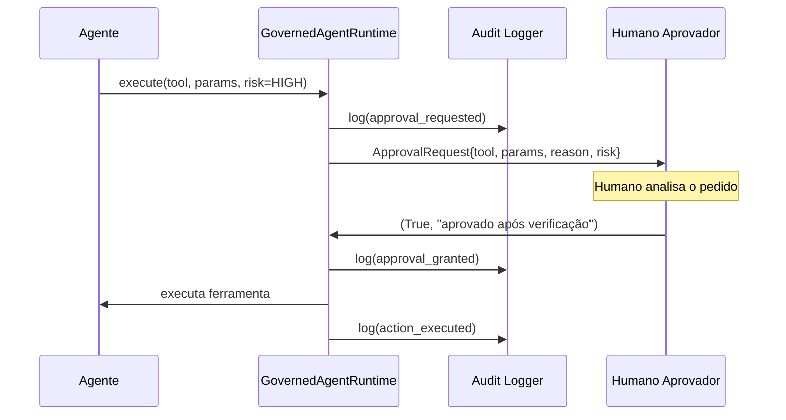

# 06 — Supervisão Humana

## Human-in-the-Loop vs. Human-on-the-Loop

| Modelo | Descrição | Quando usar |
|--------|-----------|-------------|
| **HITL** (in-the-loop) | Humano aprova **antes** da ação | Ações destrutivas, de alto impacto ou irreversíveis |
| **HOTL** (on-the-loop) | Humano monitora e pode **interromper** | Ações de impacto médio com baixa latência exigida |
| **Autônomo** | Agente executa sem supervisão | Ações de baixo risco, totalmente reversíveis e auditadas |

Este repositório implementa o modelo **HITL** para ações de alto risco.

## Fluxo de aprovação



## Configuração do aprovador

```python
# Modo interativo (terminal) — para uso em produção supervisionada
gate = ApprovalGate(interactive=True)

# Callback customizado (webhook, Slack, PagerDuty)
def slack_approver(req: ApprovalRequest) -> tuple[bool, str]:
    response = send_slack_approval_request(req)
    return response.approved, response.notes

gate = ApprovalGate(approver_callback=slack_approver)

# Auto-aprovação (apenas em testes e exemplos)
gate = ApprovalGate(auto_approve=True)
```

## Kill switch global

O kill switch é um **mecanismo de parada de emergência** que bloqueia toda execução
de agentes imediatamente, sem necessidade de alterar políticas ou código.

### Quando usar

- Incidente de segurança detectado envolvendo um agente
- Comportamento anômalo não coberto por política
- Manutenção emergencial do sistema
- Comprometimento de credenciais de agente

### Como funciona

```python
# Ativar: cria o arquivo .kill_switch com timestamp e motivo
approval_gate.activate_kill_switch("incidente P0 — vazamento de dados detectado")

# O runtime verifica o arquivo antes de qualquer ação
# → KillSwitchActiveError é levantado → ação bloqueada → auditada

# Desativar: remove o arquivo
approval_gate.deactivate_kill_switch()
```

O arquivo `.kill_switch` pode ser criado diretamente no disco por qualquer operador
com acesso ao servidor — independentemente do estado da aplicação.

```bash
# Ativação de emergência diretamente no servidor
echo "$(date -u +%Y-%m-%dT%H:%M:%SZ) | incidente de segurança" > .kill_switch

# Verificação
cat .kill_switch

# Desativação
rm .kill_switch
```

Veja o runbook completo: [`runbooks/kill-switch.md`](../runbooks/kill-switch.md)

## Triagem de aprovações por nível de risco

| Nível | Política padrão | Tempo esperado de resposta |
|-------|----------------|---------------------------|
| `low` | ALLOW (sem aprovação) | — |
| `medium` | Depende da ferramenta/ambiente | — |
| `high` | REQUIRE_APPROVAL | ≤ 15 minutos |
| `critical` | REQUIRE_APPROVAL + dupla aprovação* | ≤ 5 minutos |

\* Dupla aprovação não está implementada neste repositório — requer extensão do
`ApprovalGate` com múltiplos callbacks.
