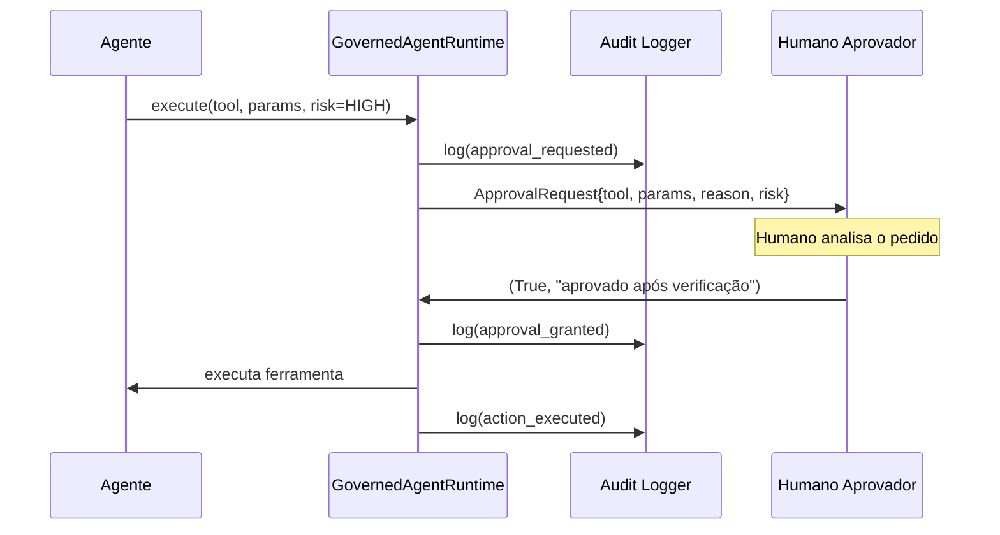

# 06 — Supervisão Humana

## Human-in-the-Loop vs. Human-on-the-Loop

| Modelo | Descrição | Quando usar |
|--------|-----------|-------------|
| **HITL** (in-the-loop) | Humano aprova **antes** da ação | Ações destrutivas, de alto impacto ou irreversíveis |
| **HOTL** (on-the-loop) | Humano monitora e pode **interromper** | Ações de impacto médio com baixa latência exigida |
| **Autônomo** | Agente executa sem supervisão | Ações de baixo risco, totalmente reversíveis e auditadas |

Este repositório implementa o modelo **HITL** para ações de alto risco.

## Aprovação simples (ApprovalGate)

Fluxo para ações `REQUIRE_APPROVAL` com um único aprovador:



```python
# Modo interativo (terminal)
gate = ApprovalGate(interactive=True)

# Callback customizado (webhook Slack, PagerDuty)
def slack_approver(req: ApprovalRequest) -> tuple[bool, str]:
    response = send_slack_approval_request(req)
    return response.approved, response.notes

gate = ApprovalGate(approver_callback=slack_approver)

# Auto-aprovação (apenas em testes e exemplos)
gate = ApprovalGate(auto_approve=True)
```

## Aprovação M-de-N (NApprovalGate)

Para operações críticas que exigem consenso de múltiplos aprovadores — ex.:
wipe de banco de dados em produção, deploy de mudança urgente, rotação massiva
de credenciais:

```python
from governance.approval.multi import NApprovalGate

# Requer 2 de 3 aprovadores
gate = NApprovalGate(
    required_approvals=2,
    available_approvers=["senior-eng-1", "senior-eng-2", "security-eng"],
    timeout_seconds=300,      # auto-deny após 5 min sem resposta
    approver_callbacks=[      # um callback por aprovador
        pagerduty_callback,
        slack_dm_callback,
    ],
)

req = gate.request_approval(
    agent_id="ops-agent",
    agent_name="OpsAgent",
    tool_name="wipe_database",
    parameters={"confirm": "yes"},
    risk_level="critical",
    reason="migração emergencial de dados",
)

if req.is_granted:
    print(f"Aprovado! {req.vote_summary()}")
else:
    print(f"Negado. {req.vote_summary()}")
```

### Lógica de decisão

- **Concedido**: `approve_count >= required_approvals`
- **Negado**: qualquer voto `DENY`, ou impossível atingir M com os votos restantes
- **Timeout**: sem resposta no prazo → `DENY` automático

## Kill switch local (por tenant)

Cada tenant tem seu próprio kill switch que bloqueia apenas os agentes daquele tenant:

```python
# Via código
tenant.activate_kill_switch("manutenção emergencial do time alpha")
tenant.deactivate_kill_switch()

# Via CLI
governance kill-switch enable "incidente de segurança no team-alpha"
governance kill-switch status
governance kill-switch disable
```

## Kill switch global (toda a plataforma)

```python
# Via TenantRuntime — afeta TODOS os tenants simultaneamente
platform = TenantRuntime(registry)
count = platform.activate_global_kill_switch("incidente P0 na plataforma")
print(f"Kill switch ativado em {count} tenants")

# Ativação de emergência direta no servidor (sem código)
echo "$(date -u +%Y-%m-%dT%H:%M:%SZ) | P0: [motivo]" > .kill_switch
```

Veja o runbook completo: [`runbooks/kill-switch.md`](../runbooks/kill-switch.md)

## Triagem de aprovações por nível de risco

| Nível | Política padrão | Aprovador | Tempo de resposta |
|-------|----------------|-----------|------------------|
| `low` | ALLOW (sem aprovação) | — | — |
| `medium` | Depende da ferramenta/ambiente | 1 aprovador | — |
| `high` | REQUIRE_APPROVAL (1-de-1) | Eng. senior ou on-call | ≤ 15 minutos |
| `critical` | REQUIRE_APPROVAL (M-de-N) | ≥ 2 aprovadores | ≤ 5 minutos |

## Detector de anomalias como camada HOTL

O `AnomalyDetector` atua como Human-on-the-Loop: detecta padrões suspeitos
e notifica os operadores para que possam intervir (ex.: ativar o kill switch)
sem necessariamente bloquear cada ação individualmente:

```python
from governance.anomaly.detector import AnomalyDetector

detector = AnomalyDetector(
    max_calls_per_minute=30.0,
    max_deny_rate=0.5,
    max_consecutive_denies=5,
    alert_handlers=[pagerduty_alert, slack_alert],
)
```

Alertas gerados:
- `WARNING high_call_rate` — velocidade acima do limite
- `WARNING high_deny_rate` — taxa de negação suspeita
- `CRITICAL consecutive_denies` — possível brute-force de ferramentas
- `INFO off_hours_activity` — ação fora do horário comercial
- `INFO new_tool_first_use` — agente usando ferramenta pela primeira vez
