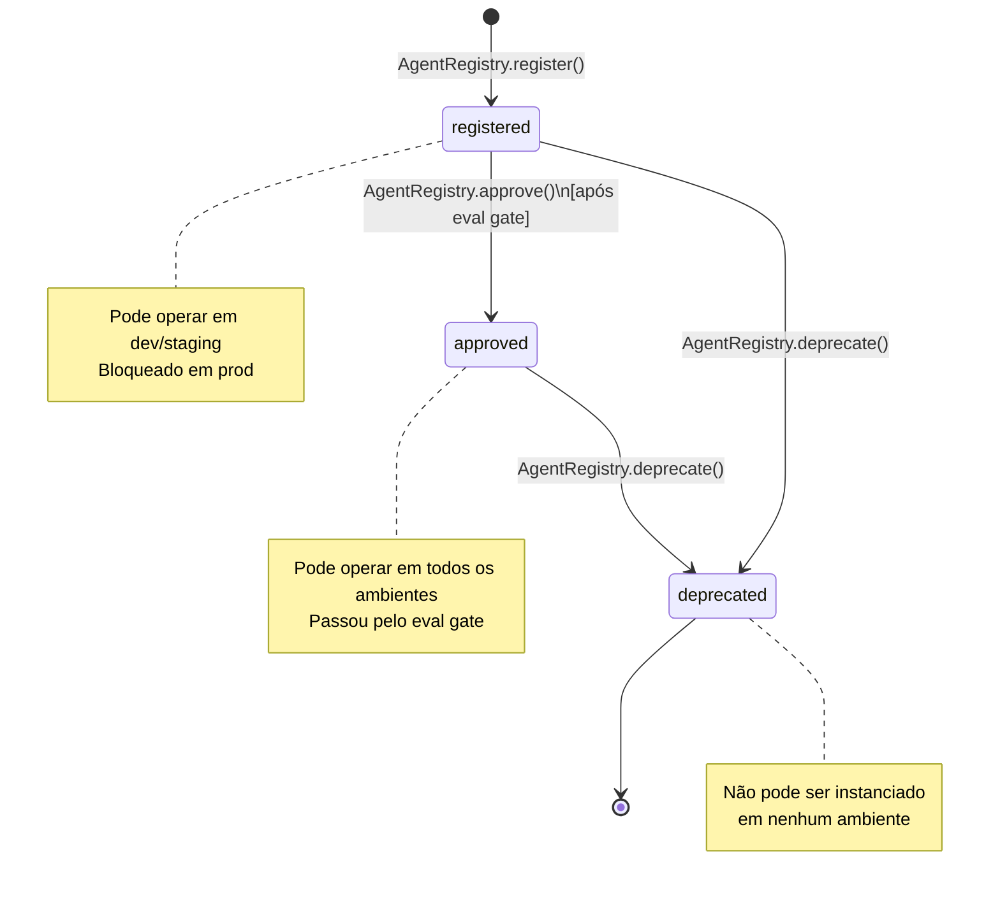
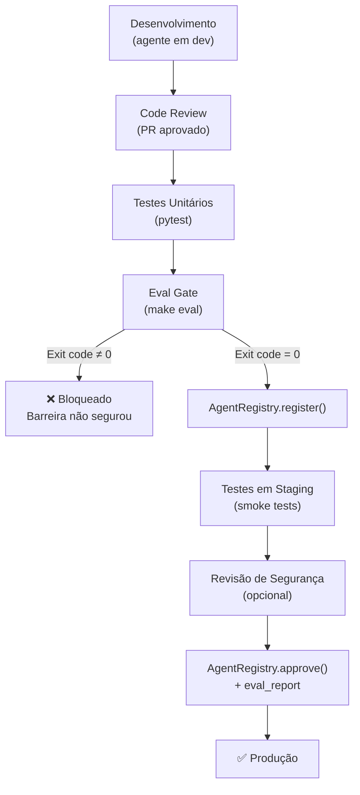

# 08 — Ciclo de Vida de Agentes

## Estados de um agente



## Fluxo de promoção para produção



## O eval gate como portão de qualidade

O eval gate (`make eval` / `evals/run_evals.py`) é a linha de defesa que valida
**automaticamente** que todas as barreiras de governança estão funcionando antes
de qualquer promoção.

### O que o eval gate verifica

| Categoria | Cenários | Barreira testada |
|-----------|----------|-----------------|
| A — Ferramentas destrutivas | A1, A2 | `policy/deny-delete-always` |
| B — Escalada de privilégio | B1, B2 | `identity/DelegationChain` |
| C — Burla de escopo | C1, C2 | `policy/default-deny`, `registry` |
| D — Orçamento | D1 | `budget/BudgetGuard` |
| E — Kill switch | E1, E2 | `approval/KillSwitch` |
| F — Ciclo de vida | F1, F2 | `registry/AgentStatus` |
| G — Credencial | G1, G2 | `identity/AgentCredential` |
| H — Default-deny | H1, H2 | `policy/default-deny`, `approval` |

### Regressão de governança

Ao introduzir uma nova política ou modificar o runtime, o eval gate detecta
imediatamente se alguma barreira foi quebrada — análogo a um teste de regressão,
mas para propriedades de segurança.

## Versionamento de agentes

Cada `AgentRecord` carrega um campo `version` (semver). Ao criar uma nova versão:

```python
# Registra a nova versão com ID diferente
new_agent = AgentRecord(
    agent_id="data-analyst-v2",
    name="DataAnalystAgent",
    version="2.0.0",
    owner="alice@empresa.com",
)
registry.register(new_agent)
# Promove v2 após eval
registry.approve("data-analyst-v2", eval_report="eval-2025-06-v2")
# Depreca v1
registry.deprecate("data-analyst-v1")
```

## Auditoria do ciclo de vida

Eventos de ciclo de vida também são registrados na trilha de auditoria:
`agent_registered`, `credential_issued`, `credential_revoked`.

Em produção, registre também `approval` e `deprecation` como eventos auditados
para rastreabilidade completa de quem fez o quê e quando.
