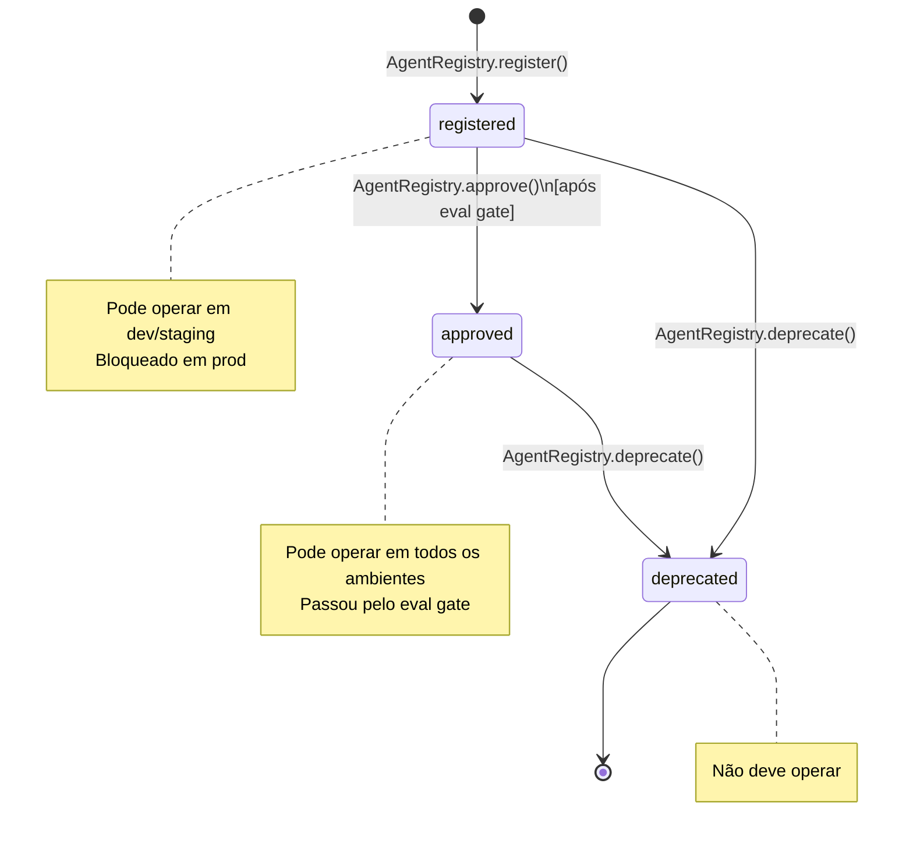
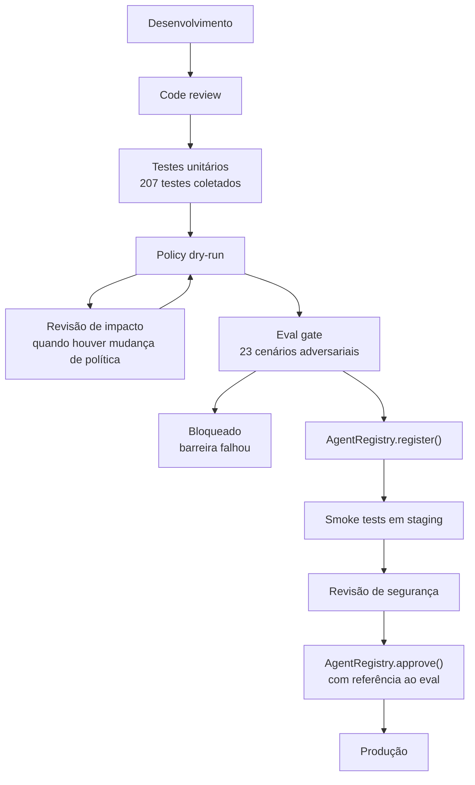

# 08: Ciclo de Vida de Agentes

## Objetivo

O ciclo de vida impede que um agente saia do desenvolvimento direto para produção sem
revisão, testes, evals adversariais e aprovação explícita. O controle central fica em
`AgentRegistry`, com apoio de policy dry-run, audit log e eval gate.

## Estados de um agente



## Fluxo recomendado para produção



## O que o eval gate verifica

O comando `make eval` executa `evals/run_evals.py`. Ele falha se qualquer barreira de
governança deixar passar uma ação adversarial.

| Categoria | Cenários | Barreira principal |
|-----------|----------|--------------------|
| A | A1, A2 | Bloqueio de ferramentas destrutivas |
| B | B1, B2 | Delegação sem escalada de privilégio |
| C | C1, C2 | Escopos, default-deny e ambiente |
| D | D1 | Orçamento |
| E | E1, E2 | Kill switch |
| F | F1, F2 | Status do agente em produção |
| G | G1, G2 | Credencial inválida ou revogada |
| H | H1, H2 | Ferramenta desconhecida e aprovação negada |
| I | I1, I2 | Prompt injection em entrada e saída |
| J | J1, J2 | Tool poisoning e servidor MCP não listado |
| K | K1 | Memory poisoning |
| L | L1, L2, L3 | Comunicação A2A insegura |

## Versionamento

Cada `AgentRecord` carrega `version`. Para mudanças incompatíveis ou relevantes de
comportamento, registre uma nova identidade lógica em vez de sobrescrever a anterior.

```python
new_agent = AgentRecord(
    agent_id="data-analyst-v2",
    name="DataAnalystAgent",
    version="2.0.0",
    owner="alice@empresa.com",
)

registry.register(new_agent)
registry.approve("data-analyst-v2", eval_report="eval-2026-06-v2")
registry.deprecate("data-analyst-v1")
```

## Auditoria e evidências

Eventos de lifecycle devem aparecer no audit log junto com decisões de política,
aprovações, negações e uso de ferramentas. Em produção, registre quem aprovou, qual eval
foi usado como evidência e qual versão foi promovida.

Para auditoria periódica:

```bash
governance report compliance audit_logs/prod/audit.jsonl \
  --output compliance_evidence.json
```

O relatório consolida evidências para NIST AI RMF, ISO/IEC 42001, EU AI Act, OWASP LLM,
OWASP Agentic e NIST GenAI Profile.
