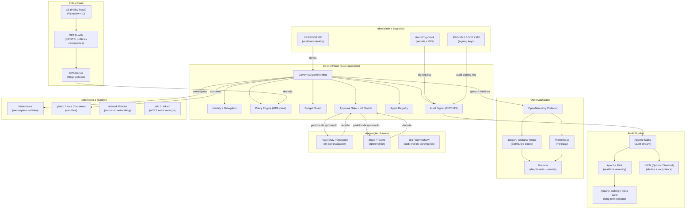

# 10: Arquitetura de Produção (Big Tech Reference)

> Este documento descreve o que uma organização de grande porte precisa montar
> **além do código deste repositório** para governança agêntica de nível produção.
> O repositório implementa a camada de controle local; este documento mapeia o restante.

---

## Diagrama completo: Big Tech Stack



---

## O que cada camada resolve

### 1. Identidade: SPIFFE/SPIRE

**Problema**: tokens em memória podem ser roubados; chaves em variáveis de ambiente vão parar em logs.

**Solução**: [SPIFFE](https://spiffe.io/) emite SVIDs (X.509 certificates de curta duração)
via SPIRE server. Cada workload recebe uma identidade criptográfica automaticamente renovada.

```bash
# Agente recebe seu SVID via socket UNIX (sem segredos no config)
SPIFFE_ENDPOINT_SOCKET=/run/spire/sockets/agent.sock
```

**Integração com este repo**: substituir `AgentCredential` por SVID;
o `IdentityManager` consulta o SPIRE Workload API em vez de emitir tokens próprios.

---

### 2. Segredos: HashiCorp Vault / KMS

**Problema**: chave Ed25519 de assinatura não pode ficar em disco em produção.

**Solução**: Vault Transit Secrets Engine ou AWS KMS. A chave nunca sai do HSM;
a aplicação passa os dados a serem assinados para o serviço.

```python
# Em produção: substituir AuditSigner.generate() por:
import boto3
kms = boto3.client("kms")
response = kms.sign(KeyId="arn:aws:kms:...", Message=payload, SigningAlgorithm="ECDSA_SHA_256")
```

---

### 3. Policy Engine: OPA + Bundle Server

**Problema**: políticas YAML versionadas localmente não escalam para múltiplas instâncias.

**Solução**: OPA Server centralizado que baixa bundles de um S3/GCS a cada X minutos.
Mudanças de política são PRs no repositório de políticas, revisados por security engineers,
e propagam automaticamente via bundle update.

```bash
# OPA com bundle remoto
opa run --server --bundle s3://minha-empresa/opa-policies/latest.tar.gz
```

**Integração com este repo**: `OpaPolicyEngine` já aponta para o OPA server;
basta mudar o `docker/opa/policies/` para apontar para o bundle remoto.

---

### 4. Audit Stream: Kafka → Iceberg

**Problema**: JSONL local não é replicado, não escala, e não é queryável em SQL.

**Solução**:

```
Agent Action → GovernedRuntime → SignedAuditLogger → Kafka Topic → Flink (real-time) → Iceberg
                                                               ↘ SIEM (Splunk/Sentinel)
```

- **Kafka**: desacopla produção do log da persistência. Buffer durável e replicado.
- **Apache Flink**: processa o stream em tempo real para detectar anomalias que
  cruzam múltiplos agentes (o `AnomalyDetector` deste repo é single-process).
- **Apache Iceberg**: armazenamento colunado queryável por SQL. `SELECT * FROM audit WHERE agent_id = 'X' AND timestamp > NOW() - INTERVAL '24 HOURS'`

---

### 5. Observabilidade: OpenTelemetry → Jaeger + Grafana

**O que já está implementado** (este repo):
- `GovernanceTelemetry` emite spans e métricas via OTEL SDK
- Docker Compose sobe Jaeger + Prometheus + Grafana
- Dashboard de governança pré-configurado

**O que adicionar em produção**:

```yaml
# otel-collector-config.yaml
receivers:
  otlp:
    protocols: { grpc: {}, http: {} }

processors:
  batch: {}
  # Enriquecer spans com metadados do K8s
  k8sattributes: {}

exporters:
  jaeger: { endpoint: "jaeger-collector:14250" }
  prometheusremotewrite:
    endpoint: "https://prometheus.empresa.com/api/v1/write"
  # Exportar traces para S3 para análise posterior
  awss3exporter:
    s3uploader:
      region: us-east-1
      s3_bucket: traces-governance

service:
  pipelines:
    traces:  { receivers: [otlp], processors: [batch, k8sattributes], exporters: [jaeger, awss3exporter] }
    metrics: { receivers: [otlp], processors: [batch], exporters: [prometheusremotewrite] }
```

---

### 6. Aprovação Humana: PagerDuty + Slack Bot

**O que já está implementado**: `ApprovalGate` com callback configurável.

**Em produção**: webhook que cria um alerta no PagerDuty e uma mensagem interativa no Slack.

```python
def pagerduty_slack_approver(req: ApprovalRequest) -> tuple[bool, str]:
    # 1. Cria incidente no PagerDuty com link para aprovar
    pd_incident = pagerduty.create_incident(
        title=f"Aprovação necessária: {req.tool_name} por {req.agent_name}",
        body=json.dumps(req.model_dump(), indent=2),
        severity="high" if req.risk_level in ("high", "critical") else "warning",
    )
    # 2. Envia mensagem interativa no Slack
    slack.post_approval_message(
        channel="#governance-approvals",
        request=req,
        pd_incident_url=pd_incident["url"],
        timeout_seconds=300,  # auto-deny após 5 min sem resposta
    )
    # 3. Espera resposta (polling ou webhook)
    return wait_for_decision(req.request_id, timeout=300)
```

---

### 7. Isolamento: Kubernetes + gVisor

**Problema**: um agente comprometido pode escapar do processo Python e acessar o host.

**Solução**:

```yaml
# Pod com gVisor (runsc) e NetworkPolicy zero-trust
apiVersion: v1
kind: Pod
metadata:
  annotations:
    io.kubernetes.cri.untrusted-workload: "true"
spec:
  runtimeClassName: gvisor        # sandbox com kernel separado
  securityContext:
    runAsNonRoot: true
    readOnlyRootFilesystem: true
    allowPrivilegeEscalation: false
  containers:
    - name: agent
      resources:
        limits:
          cpu: "0.5"
          memory: "256Mi"         # blast radius de recursos
```

---

### 8. Anomaly Detection: ML em Produção

O `AnomalyDetector` deste repo é rule-based. Em produção de grande escala:

| Abordagem | Quando usar | Ferramenta |
|-----------|------------|------------|
| Rule-based (este repo) | Regras conhecidas, baixo FP aceitável | ✅ Implementado |
| Statistical baselines | Detectar desvio de comportamento normal | Z-score, IQR |
| Isolation Forest | Anomalias multivariadas sem labels | scikit-learn |
| Seq2Seq / LSTM | Sequências de ações anômalas | PyTorch |
| LLM-based | "Esta sequência de ações faz sentido?" | Classificador LLM via adapter |

O pipeline sugerido:
```
Audit Events → Feature Extraction → Isolation Forest → Alert Queue → Human Review
                                  ↘ Rule Engine (deste repo) → Immediate Alert
```

---

## Checklist de maturidade

| Nível | Critério | Este repo | Produção |
|-------|---------|-----------|---------|
| **L1** | Audit log estruturado | ✅ | ✅ |
| **L1** | Default-deny policy | ✅ | ✅ |
| **L1** | Kill switch | ✅ | ✅ |
| **L2** | Hash chain verificável | ✅ | ✅ |
| **L2** | Assinatura criptográfica | ✅ Ed25519 | ✅ KMS/HSM |
| **L2** | OpenTelemetry | ✅ | ✅ Collector |
| **L2** | Anomaly detection | ✅ Rule-based | ✅ + ML |
| **L3** | OPA/Cedar | ✅ Client + fallback | ✅ Bundle server |
| **L3** | SPIFFE/SVID | ❌ Doc | ✅ SPIRE |
| **L3** | Audit stream (Kafka) | ❌ Doc | ✅ |
| **L3** | Sandbox (gVisor) | ❌ Doc | ✅ |
| **L4** | mTLS (Istio) | ❌ Doc | ✅ |
| **L4** | Compliance automation | ❌ Doc | ✅ Drata/Vanta |
| **L4** | ML anomaly detection | ❌ Doc | ✅ |
| **L4** | Multi-region replication | ❌ Doc | ✅ |

**L1-L2**: PoC / startup em crescimento
**L3**: Scale-up / empresa de médio porte
**L4**: Big tech / regulado (fintech, saúde, governo)
