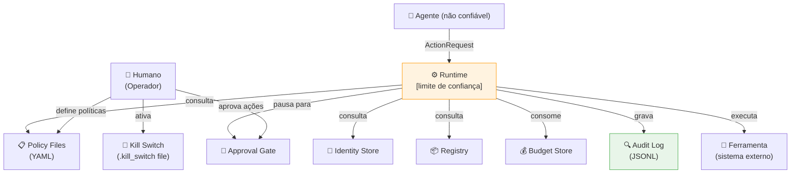

# Modelo de Ameaça — Sistema de Governança Agêntica

**Versão:** 2.0  
**Data:** 2026-06-04  
**Metodologia:** STRIDE + OWASP Top 10 for LLM/Agentic Applications

---

## Escopo

Este modelo cobre o sistema de governança (`src/governance/`) e os agentes que
operam sob ele. Não cobre:

- A infraestrutura de nuvem subjacente
- A segurança do modelo de LLM em si (pesos, fine-tuning)
- O acesso físico aos servidores

---

## Diagrama de fluxo de dados (DFD Nível 1)

**Limite de confiança:** O `GovernedAgentRuntime` é o único ponto onde código
não-confiável (o agente) cruza para sistemas confiáveis (ferramentas, audit log).

---

## Análise STRIDE

### S — Spoofing (Falsificação de identidade)

| Ameaça | Cenário | Mitigação | Risco residual |
|--------|---------|-----------|---------------|
| S1 | Agente forja o `agent_id` de outro agente | Credenciais de curta duração com token único | Baixo |
| S2 | Sub-agente se apresenta como agente raiz | `parent_id` rastreável; runtime não altera a identidade | Baixo |
| S3 | Processo malicioso injeta AgentIdentity na memória | Identidade validada na borda; não reutilizável entre processos | Médio* |

\* Risco residual em ambientes de múltiplos processos sem SPIFFE.

### T — Tampering (Adulteração)

| Ameaça | Cenário | Mitigação | Risco residual |
|--------|---------|-----------|---------------|
| T1 | Adulteração do audit log | Hash chain SHA-256 + assinatura **Ed25519** por entrada | Baixo* |
| T2 | Modificação de arquivo de política | Git history; CI valida as políticas | Baixo |
| T3 | Modificação do arquivo .kill_switch | Permissões de SO; monitoramento | Médio |

\* Com `SignedAuditLogger`: sem a chave privada, impossível recriar assinaturas válidas. Em produção, manter chave no KMS/HSM.

### R — Repudiation (Repúdio)

| Ameaça | Cenário | Mitigação | Risco residual |
|--------|---------|-----------|---------------|
| R1 | Agente nega ter executado ação | Toda ação auditada com agent_id e timestamp | Baixo |
| R2 | Operador nega ter aprovado ação | Aprovação registrada com `decided_by` | Baixo* |

\* Sem assinatura criptográfica, o campo `decided_by` é auto-declarado.

### I — Information Disclosure (Divulgação de informação)

| Ameaça | Cenário | Mitigação | Risco residual |
|--------|---------|-----------|---------------|
| I1 | Agente extrai segredos via tool chaining | `read:secrets` como escopo separado + `SecretStore` com access policy | Baixo |
| I2 | Audit log expõe dados pessoais nos parâmetros | **PIIMasker** aplicado antes de gravar (e-mail, CPF, JWT, IP, cartão) | Baixo* |
| I3 | Prompt injection revela configuração interna | Runtime não expõe config ao agente | Baixo |

\* Com `PIIMasker.with_defaults()` ativo no `GovernanceConfig`. Adicionar padrões customizados para dados específicos do domínio.

### D — Denial of Service (Negação de serviço)

| Ameaça | Cenário | Mitigação | Risco residual |
|--------|---------|-----------|---------------|
| D1 | Agente consome orçamento maliciosamente | BudgetGuard com tetos duros | Baixo |
| D2 | Agente spawna sub-agentes infinitos | `spawn:subagent` é escopo explícito | Baixo |
| D3 | Ferramenta fica pendurada (hang) | Timeout configurável no runtime | Baixo |
| D4 | Flooding de pedidos de aprovação | Rate limit por minuto no BudgetGuard | Baixo |
| D5 | Ferramenta com falhas cascateia para outros agentes | **CircuitBreaker** por ferramenta (OPEN após N falhas) | Baixo |

### E — Elevation of Privilege (Escalada de privilégio)

| Ameaça | Cenário | Mitigação | Risco residual |
|--------|---------|-----------|---------------|
| E1 | Sub-agente delega escopo que não possui | DelegationChain.add_link() bloqueia | Muito baixo |
| E2 | Agente em dev cria agente em prod | Ambiente é parte da identidade; registry valida | Baixo |
| E3 | Agente manipula motor de política via parâmetros | Engine é stateless; parâmetros são dados, não código | Baixo |
| E4 | Agente `registered` opera em prod | Registry verifica status APPROVED antes de prod | Muito baixo |
| E5 | Agente de tenant A acessa recursos de tenant B | **TenantRuntime** verifica pertencimento antes de executar | Muito baixo |

---

## OWASP Top 10 for LLM — Análise detalhada

### LLM01 — Prompt Injection

**Cenário:** Um input malicioso instrui o agente a executar `delete_files`.

**Mitigação:** O runtime intercepta a ação resultante, não o prompt. Mesmo que o
agente "queira" deletar arquivos, a política `deny-delete-always` bloqueia antes
da execução. O prompt injection pode comprometer o raciocínio do agente, mas
não pode contornar a política.

**Residual:** Se o agente possui escopo `write:files` e uma política permite escrita,
um prompt injection pode induzi-lo a sobrescrever arquivos. Mitigação: scope mínimo
e `max` conditions nos parâmetros (ex.: limitar o path).

### LLM04 — Model Denial of Service

**Cenário:** Adversário envia prompts que forçam o agente a fazer milhares de
chamadas de ferramenta.

**Mitigação:** `BudgetGuard` com `max_calls`, `max_calls_per_minute` e `max_tokens`.
Após o limite, a próxima chamada é bloqueada e auditada.

### LLM08 — Excessive Agency

**Cenário:** Agente recebe mais permissões do que precisa e abusa delas.

**Mitigação:** Princípio de privilégio mínimo + default-deny garantem que o agente
só pode fazer o que foi explicitamente autorizado.

---

## Mitigações implementadas neste repositório (v2)

| Ameaça anterior | Mitigação implementada |
|----------------|----------------------|
| T1 — adulteração de log | ✅ `SignedAuditLogger` + Ed25519 (`src/governance/signing/`) |
| I2 — dados pessoais no log | ✅ `PIIMasker` com padrões built-in + custom (`src/governance/masking/`) |
| D5 — cascata de falhas | ✅ `CircuitBreaker` por ferramenta (`src/governance/circuit_breaker/`) |
| E5 — isolamento multi-tenant | ✅ `TenantRuntime` + `Tenant` (`src/governance/tenancy/`) |

## Mitigações ainda não implementadas neste repositório

| Ameaça | Mitigação recomendada para produção |
|--------|-------------------------------------|
| S3 (spoofing entre processos) | SPIFFE/SVID com workload identity (SPIRE) |
| T1 (chave de signing em disco) | Migrar chave Ed25519 para AWS KMS / GCP KMS / Vault Transit |
| T3 (kill switch file mutável) | Permissões de SO restritivas; monitoramento de integridade de arquivo |
| R2 (repúdio de aprovações M-de-N) | Assinatura criptográfica de cada voto do aprovador |

---

## Ameaças da era agêntica (Fase 8 — OWASP Top 10 for Agentic Applications)

Vetores específicos de sistemas agênticos, onde a ação pode ser "autorizada" mas o ataque
está no **conteúdo** ou na **proveniência** — não cobertos por RBAC/política:

| Ameaça (OWASP Agentic) | Vetor | Mitigação |
|------------------------|-------|-----------|
| ASI01 Goal Hijacking | injeção indireta em conteúdo externo / saída de tool | Guardrails de conteúdo (`guardrails/`), in e out |
| ASI06 Tool Misuse | descrição de ferramenta envenenada | Integridade por fingerprint assinada (`supply_chain/`) |
| ASI07 Agentic Supply Chain | servidor MCP comprometido | Allowlist MCP + AI-BOM (`supply_chain/`) |
| ASI09 Memory Poisoning | conteúdo malicioso persistido na memória | Trust labels + quarentena na recuperação (`memory/`) |
| ASI04 Insecure Inter-Agent Comm | forja/replay/tamper de mensagens A2A | Canal assinado Ed25519 + nonce (`a2a/`) |

Cada vetor é exercitado por cenários adversariais (I–L) no eval gate. Ver
[ADR-008](../docs/adr/ADR-008-defesas-agenticas.md).

## Declaração de risco residual

Este repositório é uma **implementação de referência educacional**. Com as mitigações
da v2 (Ed25519, PIIMasker, CircuitBreaker, multi-tenancy), o risco residual foi
reduzido significativamente. Para uso em produção com dados reais, os itens da
tabela acima devem ser endereçados antes do deploy em ambientes regulados.
