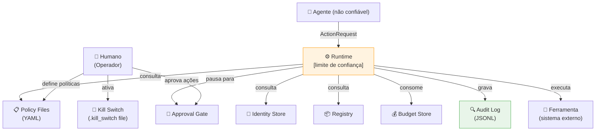

# Modelo de Ameaça — Sistema de Governança Agêntica

**Versão:** 1.0  
**Data:** 2025-06-01  
**Metodologia:** STRIDE + OWASP Top 10 for LLM/Agentic Applications

---

## Escopo

Este modelo cobre o sistema de governança (`src/governance/`) e os agentes que
operam sob ele. Não cobre:

- A infraestrutura de nuvem subjacente
- A segurança do modelo de LLM em si (pesos, fine-tuning)
- O acesso físico aos servidores

---

## Diagrama de fluxo de dados (DFD Nível 1)

**Limite de confiança:** O `GovernedAgentRuntime` é o único ponto onde código
não-confiável (o agente) cruza para sistemas confiáveis (ferramentas, audit log).

---

## Análise STRIDE

### S — Spoofing (Falsificação de identidade)

| Ameaça | Cenário | Mitigação | Risco residual |
|--------|---------|-----------|---------------|
| S1 | Agente forja o `agent_id` de outro agente | Credenciais de curta duração com token único | Baixo |
| S2 | Sub-agente se apresenta como agente raiz | `parent_id` rastreável; runtime não altera a identidade | Baixo |
| S3 | Processo malicioso injeta AgentIdentity na memória | Identidade validada na borda; não reutilizável entre processos | Médio* |

\* Risco residual em ambientes de múltiplos processos sem SPIFFE.

### T — Tampering (Adulteração)

| Ameaça | Cenário | Mitigação | Risco residual |
|--------|---------|-----------|---------------|
| T1 | Adulteração do audit log | Hash chain SHA-256; verify_chain() | Médio* |
| T2 | Modificação de arquivo de política | Git history; CI valida as políticas | Baixo |
| T3 | Modificação do arquivo .kill_switch | Permissões de SO; monitoramento | Médio |

\* Um atacante com acesso ao disco pode recriar toda a cadeia (sem assinatura assimétrica).

### R — Repudiation (Repúdio)

| Ameaça | Cenário | Mitigação | Risco residual |
|--------|---------|-----------|---------------|
| R1 | Agente nega ter executado ação | Toda ação auditada com agent_id e timestamp | Baixo |
| R2 | Operador nega ter aprovado ação | Aprovação registrada com `decided_by` | Baixo* |

\* Sem assinatura criptográfica, o campo `decided_by` é auto-declarado.

### I — Information Disclosure (Divulgação de informação)

| Ameaça | Cenário | Mitigação | Risco residual |
|--------|---------|-----------|---------------|
| I1 | Agente extrai segredos via tool chaining | `read:secrets` como escopo separado | Baixo |
| I2 | Audit log expõe dados sensíveis nos parâmetros | `output_preview` truncado a 200 chars | Médio* |
| I3 | Prompt injection revela configuração interna | Runtime não expõe config ao agente | Baixo |

\* Os parâmetros das ações ficam no log. Considere mascaramento em produção.

### D — Denial of Service (Negação de serviço)

| Ameaça | Cenário | Mitigação | Risco residual |
|--------|---------|-----------|---------------|
| D1 | Agente consome orçamento maliciosamente | BudgetGuard com tetos duros | Baixo |
| D2 | Agente spawna sub-agentes infinitos | `spawn:subagent` é escopo explícito | Baixo |
| D3 | Ferramenta fica pendurada (hang) | Timeout configurável no runtime | Baixo |
| D4 | Flooding de pedidos de aprovação | Rate limit por minuto no BudgetGuard | Baixo |

### E — Elevation of Privilege (Escalada de privilégio)

| Ameaça | Cenário | Mitigação | Risco residual |
|--------|---------|-----------|---------------|
| E1 | Sub-agente delega escopo que não possui | DelegationChain.add_link() bloqueia | Muito baixo |
| E2 | Agente em dev cria agente em prod | Ambiente é parte da identidade; registry valida | Baixo |
| E3 | Agente manipula motor de política via parâmetros | Engine é stateless; parâmetros são dados, não código | Baixo |
| E4 | Agente `registered` opera em prod | Registry verifica status APPROVED antes de prod | Muito baixo |

---

## OWASP Top 10 for LLM — Análise detalhada

### LLM01 — Prompt Injection

**Cenário:** Um input malicioso instrui o agente a executar `delete_files`.

**Mitigação:** O runtime intercepta a ação resultante, não o prompt. Mesmo que o
agente "queira" deletar arquivos, a política `deny-delete-always` bloqueia antes
da execução. O prompt injection pode comprometer o raciocínio do agente, mas
não pode contornar a política.

**Residual:** Se o agente possui escopo `write:files` e uma política permite escrita,
um prompt injection pode induzi-lo a sobrescrever arquivos. Mitigação: scope mínimo
e `max` conditions nos parâmetros (ex.: limitar o path).

### LLM04 — Model Denial of Service

**Cenário:** Adversário envia prompts que forçam o agente a fazer milhares de
chamadas de ferramenta.

**Mitigação:** `BudgetGuard` com `max_calls`, `max_calls_per_minute` e `max_tokens`.
Após o limite, a próxima chamada é bloqueada e auditada.

### LLM08 — Excessive Agency

**Cenário:** Agente recebe mais permissões do que precisa e abusa delas.

**Mitigação:** Princípio de privilégio mínimo + default-deny garantem que o agente
só pode fazer o que foi explicitamente autorizado.

---

## Mitigações não implementadas neste repositório

| Ameaça | Mitigação recomendada para produção |
|--------|-------------------------------------|
| T1 (adulteração de log) | Assinatura Ed25519 + WORM storage |
| S3 (spoofing entre processos) | SPIFFE/SVID com workload identity |
| I2 (dados sensíveis no log) | Mascaramento de PII antes de gravar |
| R2 (repúdio de aprovações) | Assinatura criptográfica do aprovador |

---

## Declaração de risco residual

Este repositório é uma **implementação de referência educacional**. Para uso em
produção com dados reais, as mitigações marcadas como "Médio" acima devem ser
endereçadas antes do deploy.
